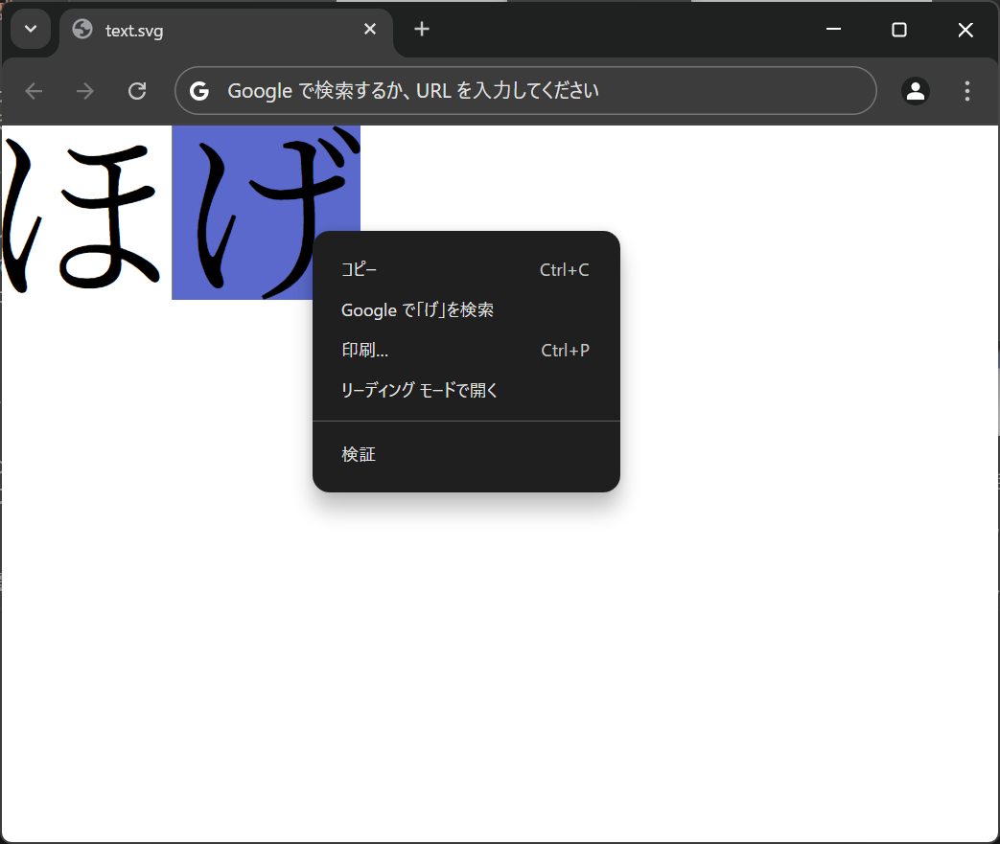
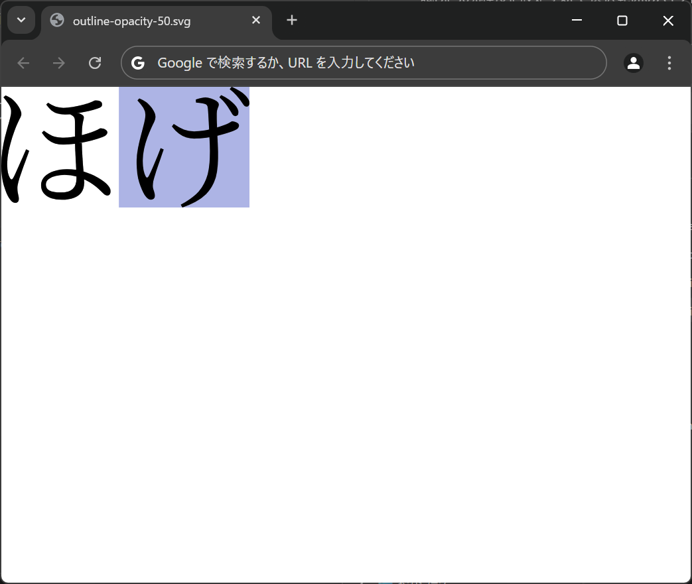
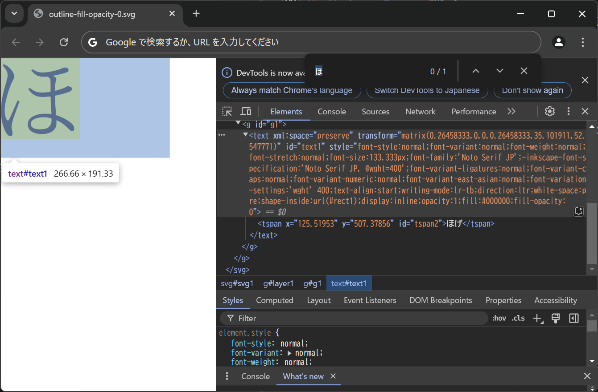

## SVGの`text`要素のアウトライン化と選択・検索を両立させる

OSはWindows、WebブラウザはGoogle Chrome 132.0.6834.160、SVG編集の説明はInkscape 1.4 (86a8ad7, 2024-10-11)を前提としています。

SVGをWebブラウザで開くとき、特に禁止しない限り`text`要素のテキストは選択および検索が可能です。

<figure><figcaption><code>text</code>要素を含むSVG</figcaption></figure>

<figure><figcaption>Webブラウザでテキストを選択</figcaption></figure>

SVGをWebブラウザで表示すると、特に制限を設けない限り、text要素のテキストは選択や検索が可能です。

しかし、指定されたフォントが利用できない場合、正しく表示されないことがあります。特殊なフォントを使用する部分やデザイン性を重視する箇所では、アウトライン化することで意図したデザインを維持できます。

1. ［レイヤー＞レイヤーとオブジェクト］
2. 出現したパネルで対象のテキストオブジェクトを選択
3. ［パス＞オブジェクトをパスへ］

<figure><figcaption><code>text</code>要素をパスに変換したSVG</figcaption></figure>

ただし、単純にアウトライン化するとテキストは選択できなくなります。

素朴な発想として、アウトライン化したパスに不可視のテキストを重ねることで、見える内容は固定しつつテキストを選択可能にできるはずです。パスと元になった`text`要素はグループにまとめておくのがよいでしょう。

1. ［オブジェクト＞グループ化］
2. 「レイヤーとオブジェクト」パネルで、グループ内に移動したテキストオブジェクトを選択
3. ［（右クリック）＞複製］
4. 上にあるほうを選択して［パス＞オブジェクトをパスへ］（上にあるものが勝つ）

`text`要素を不可視にする方法はいくつか考えられますが、それぞれに制限があります。

まず、`display:none`（「レイヤーとオブジェクト」パネルで目のアイコンをクリック）では、`text`要素を削除してアウトライン化した場合と同様にテキストの選択が無効になります。

<figure>
<figcaption><code>display:none</code></figcaption>

</figure>

続いて、`display`は既定値のまま`opacity: 0`（「レイヤーとオブジェクト」パネルで不透明度を0に設定）にする場合は、選択は可能ですが選択範囲が表示されなくなります。

<figure>
<figcaption><code>opacity: 0</code></figcaption>

</figure>

試しに50%程度に設定すると、選択範囲のハイライトの不透明度もオブジェクトの不透明度に従うことが分かります。

<figure>
<figcaption><code>opacity: 50</code></figcaption>

</figure>

<figure>
<figcaption>冒頭の画像より明らかに薄い</figcaption>

</figure>

`fill-opacity: 0`であれば、`text`要素を不可視にしつつ選択範囲のハイライトを維持できました。InkscapeのUIからはこの設定ができないため、［編集＞XMLエディタ］を開き、`text`要素の`style`に`fill-opacity: 0`を手動で加えてください。

<figure>
<figcaption><code>fill-opacity: 0</code></figcaption>

</figure>

DevToolsで`path`要素を削除すれば、確かに`text`要素は透明になっていることが分かります。

<figure>
<figcaption>透明な文字も検索にはヒットする</figcaption>

</figure>
