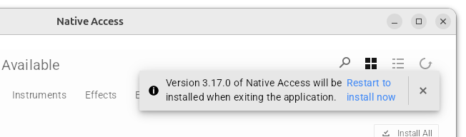
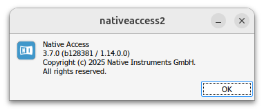

## Native Accessのアップデートを阻止する

Native Access 3.7.0ならWineで起動できそうだ。

- https://appdb.winehq.org/objectManager.php?sClass=application&iId=19265

<details>

<!-- timestamp: 20231125121751 -->

- おおむね書いてある通りの操作で実行できた（Ubuntu 24.04 / wine-9.21 (Staging)）。手間取って以下の試行錯誤をした。
  - （順番通りに行えばおそらく不要）`~/.local/share/applications/Native\ Access.desktop`の末尾に`MimeType=x-scheme-handler/native-access`を追記した
  - （順番通りに行えばおそらく不要）`update-desktop-database ~/.local/share/applications/`を実行した
  - `xdg-mime query default x-scheme-handler/native-access`で正しく登録されているかわかる
  - `NTKDaemon`はアプリケーションではなくサービスだから、exeを直接実行するのではなく、`$ WINEPREFIX=~/.wineprefixes/Native-Access_2_3.7.0 wine net start NTKDaemonService`で開始するはず。[参考](https://support.native-instruments.com/hc/ja/articles/5706203334161-Native-Access-%E3%81%8C%E8%B5%B7%E5%8B%95%E6%99%82%E3%81%AB-Installing-Dependencies-%E3%81%A7%E3%83%95%E3%83%AA%E3%83%BC%E3%82%BA%E3%81%97%E3%81%A6%E3%81%97%E3%81%BE%E3%81%86)
- 執筆時点の最新版である3.17.0は、3.7.0のコメントにある通りwinetricksでvcrun2022をインストールすれば起動した。
  - 別途ダウンロード方式のライブラリを追加する際に「Could not add library」と表示され追加できないため断念した。
- Kontakt 8 Playerはインストールできないようだ。デバッグログを見たら何かわかるか？
  - この症状 https://www.reddit.com/r/winehq/comments/1hyev6y/im_trying_to_install_native_instruments_kontakt_8/
- 7も厳しいかも。Native Accessでlocate済みのライブラリを読み込まない（yabridge 5.1.1）。よそでは動作しているらしいので要検証

</details>

ということで勝手にバージョンが上がってほしくない。当て勘で関連ファイルを漁ってみたところ、この`updaterCacheDirName`ディレクトリが臭う。

```
$ cat ~/.wineprefixes/Native-Access_2_3.7.0/drive_c/Program\ Files/Native\ Instruments/Native\ Access/resources/app-update.yml 
provider: generic
channel: latest
url: https://na-update.native-instruments.com
updaterCacheDirName: nativeaccess2-updater
```

旧バージョンを起動しているとウィンドウ右上にアップデートを促すメッセージが出現する。



この状態で、`updaterCacheDirName`を探してみる。

```
$ find ~/.wineprefixes/Native-Access_2_3.7.0/drive_c/ -name nativeaccess2-updater
/home/mukai/.wineprefixes/Native-Access_2_3.7.0/drive_c/users/mukai/AppData/Local/nativeaccess2-updater

$ tree ~/.wineprefixes/Native-Access_2_3.7.0/drive_c/users/mukai/AppData/Local/nativeaccess2-updater
/home/mukai/.wineprefixes/Native-Access_2_3.7.0/drive_c/users/mukai/AppData/Local/nativeaccess2-updater
└── pending
    ├── Native-Access.exe
    └── update-info.json

2 directories, 2 files
```

消してみる。

```
$ rm -rf ~/.wineprefixes/Native-Access_2_3.7.0/drive_c/users/mukai/AppData/Local/nativeaccess2-updater
```

Native Accessを［x］で終了して再度起動すると、目論見通りアップデートされずに保たれているようだ。



書き込み・削除禁止にしておけばよいはず。

```
$ mkdir -p ~/.wineprefixes/Native-Access_2_3.7.0/drive_c/users/mukai/AppData/Local/nativeaccess2-updater
$ sudo chattr +i ~/.wineprefixes/Native-Access_2_3.7.0/drive_c/users/mukai/AppData/Local/nativeaccess2-updater
```

さすがにディレクトリを変えたりするほど器用ではないらしい。
