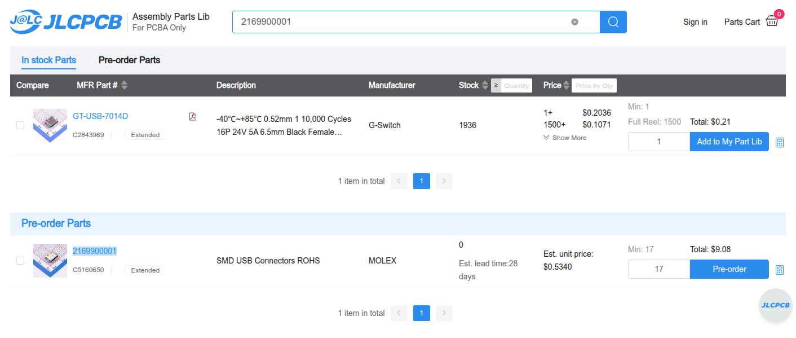
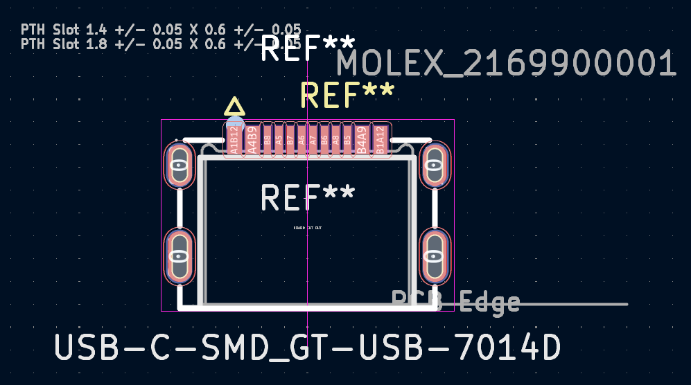

## ミッドマウントタイプのUSB Type-C レセプタクルについて

JLCPCB Assembly Parts Libで[Molex 2169900001](https://www.molex.com/en-us/products/part-detail/2169900001)を検索したら、[G-Switch GT-USB-7014D](https://jlcpcb.com/partdetail/GSwitch-GT_USB7014D/C2843969)なら在庫があると言わんばかりに紹介された。

[G-Switch](https://www.lcsc.com/brand-detail/12389.html)は中国の会社らしい。最低限LCSCのAuthorisedメーカーではある。比較的安価だし、JLCPCBのPCBAで使いやすい。とはいえLCSC以外から入手しづらいので、「2169900001のフットプリントを使っておいてGT-USB-7014Dを指定する」のような使い方ができるとよさそう。

- [2169900001 Symbol, Footprint & 3D Model by Molex | SnapMagic Search (formerly SnapEDA)](https://www.snapeda.com/parts/2169900001/Molex/view-part/)
- `mkdir GT-USB-7014D && cd GT-USB-7014D && easyeda2kicad --full --lcsc_id=C2843969 --output ./GT-USB-7014D`

寸法資料上の数値はほとんど同じで、フットプリントを重ねてもほとんど違いはなかった。

