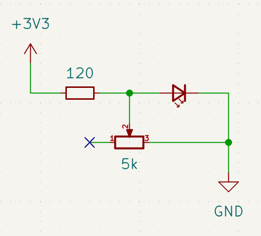
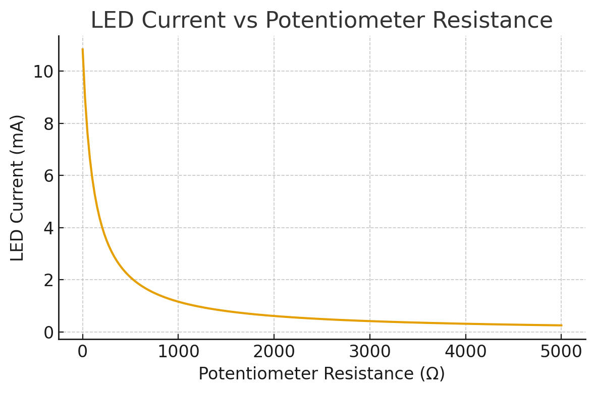
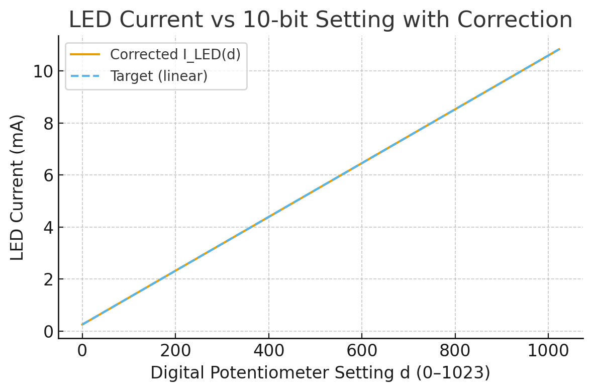

## 可変抵抗によるLED光量調整



可変抵抗のワイパー位置が2=1のとき、LEDに充分な電流が流れる。ワイパー位置が2=3のとき、LED側にはほとんど電流が流れなくなる。

LED電流（ほぼ光量）は次のように表せる。

$$
I_{LED} = \frac{V_{CC} - V_f}{R_{LED} + R_{pot}}
$$

$V_{CC} = 3.3V$、$R_{LED} = 120Ω$、一般的な赤色LEDを仮定して順方向電圧$V_{f} = 2.0V$。

$$
I_{LED} = \frac{1.3}{120 + R_{pot}}
$$

```python
import numpy as np
import matplotlib.pyplot as plt

Vcc = 3.3
R_led = 120
Vf_led = 2.0
R_pot = np.linspace(0, 5000, 200)
I_led = (Vcc - Vf_led) / (R_led + R_pot)

plt.figure(figsize=(6,4))
plt.plot(R_pot, I_led * 1000)
plt.title("LED Current vs Potentiometer Resistance")
plt.xlabel("Potentiometer Resistance (Ω)")
plt.ylabel("LED Current (mA)")
plt.grid(True)
plt.tight_layout()
plt.show()
```



可変抵抗が10ビットデジタルポテンショメータ（MCP42U83）であると仮定し、光量を線形に補正することを考える。入力値$d$について以下の関係を得たい。

$$
I_{LED}(d) = I_{min} + \frac{d}{1023} (I_{max} - I_{min})
$$

$I_{LED}$についての式を$R_{pot}$について変形する。

$$
R_{pot} = \frac{V_{CC} - V_f}{I_{LED}} - R_{LED}
$$

さらに$I_{LED}(d)$を代入することで、$R_{pot}$について$d$の関数を得られる。

$$
R_{pot}(d) = \frac{V_{CC} - V_f}{I_{min} + \frac{d}{1023} (I_{max} - I_{min})} - R_{LED}
$$

ここで、

$$
I_{max} = \frac{3.3 - 2.0}{120} = 10.83\,\mathrm{mA}
$$

$$
I_{min} = \frac{3.3 - 2.0}{120 + 5000} = 0.25\,\mathrm{mA}
$$

したがって、

$$
R_{pot}(d) = \frac{1.3}{0.00025 + \frac{d}{1023} (0.01083 - 0.00025)} - 120
$$

```python
import numpy as np
import matplotlib.pyplot as plt

Vcc = 3.3
Vf = 2.0
R_led = 120.0
Rpot_max = 5000.0
I_max = (Vcc - Vf) / R_led
I_min = (Vcc - Vf) / (R_led + Rpot_max)

d = np.arange(0, 1024)

I_target = I_min + (d/1023.0) * (I_max - I_min)
R_pot = (Vcc - Vf) / I_target - R_led
I_circuit = (Vcc - Vf) / (R_led + R_pot)

plt.figure(figsize=(6,4))
plt.plot(d, I_circuit * 1e3, label="Corrected I_LED(d)")
plt.plot(d, I_target * 1e3, linestyle="--", label="Target (linear)")
plt.title("LED Current vs 10-bit Setting with Correction")
plt.xlabel("Digital Potentiometer Setting d (0–1023)")
plt.ylabel("LED Current (mA)")
plt.grid(True)
plt.legend()
plt.tight_layout()
plt.show()
```




ただし回路に注意。

```
A,W,Bのどの範囲をレオスタットとして使うかによって挙動が異なることがわかりました。W-B間を使う「WをLED、BをGNDに落としてAをオープン（もとの回路図）」「BをLED、WをGNDに落としてAをオープン」の場合は概ね線形に変化します。しかしA-W間を使う「WをLED、AをGNDに落としてBをオープン」「AをLED、WをGNDに落としてBをオープン」の形では全範囲でほぼ全灯になり、極限付近で一瞬だけちらつきます。

ChatGPT:
ご報告の挙動は、MCP42U83（デジタル・ポテンショメータ）を**レオスタット（2端子）**として使う際の“どの2端子を使うか”と“電流の流れ方向（どちら側を開放するか）”に強く依存するために起きています。ポイントだけ簡潔に整理します。

---

# なぜ W–B だと概ね線形で、A–W だとほぼ全灯になるのか

## 1) デジタル・ポテンショメータ内部の実像

* 端子 **A–B** の間に均等分割された抵抗ラダー（合計 (R_{AB})）があり、**W** はそのタップにスイッチで接続されます。
* “理想的”には
  [
  R_{WB}(n) \approx R_w + R_{AB}\cdot \frac{n}{1024},\qquad
  R_{WA}(n) \approx R_w + R_{AB}\cdot \Bigl(1-\frac{n}{1024}\Bigr)
  ]
  （(n): 0–1023、(R_w): ワイパ内部抵抗）
  のように**W–B**も**W–A**も単調に変化します。

しかし実機では、**未使用端子を開放した側に向かって電流を流そうとすると、ほとんどのコード範囲で“短絡に近い経路（低インピーダンス）”が選ばれてしまう**場合があります。結果として LED 直列抵抗は 120 Ωだけが支配的になり、**ほぼ全域で全灯**に近づき、端のごく狭い範囲でだけ明るさが動きます。

### 具体例（今回の4パターン）

* **W–B を使用**

  * 「W を LED 側、B を GND、A 開放」
  * 「B を LED 側、W を GND、A 開放」
    → **電流が“使用している端子側（B 側）”に抜ける**ため、コードに応じて**抵抗ラダーを素直に経由**し、実効抵抗が広い範囲で変化。**概ね線形**に見えます。

* **A–W を使用**

  * 「W を LED 側、A を GND、B 開放」
  * 「A を LED 側、W を GND、B 開放」
    → 電流が**開放している側（B 側）方向へは流れず**、ワイパ近傍のスイッチ／配線の**低インピーダンス経路が支配的**になりやすい。多くのコードで**実効抵抗が小さいまま**になり、**全域でほぼ全灯**、端でわずかに変化（ちらつき）だけが見える、という挙動になります。

要するに、**“開放している側に向かって”電流が流れる構成を避け、必ず使用する固定端子（A または B）側へ電流が抜けるように**組む必要があります。実務上は**レオスタットは W–B（または W–A）を使い、もう一方の固定端子は“源（ソース）側”にしない**、という配線規律が有効です。

---

# 実装上の指針

1. **W–B レオスタットを基本にする**

   * 使わない端子（A）は**入力側（LED/電源側）にしない**。A は未接続でよいが、**電流の通り道は W–B 間**に限定する。

2. **ファーム側の線形化は W–B を前提にする**

   * 理想化モデルでは
     [
     R_{WB}(n) \approx R_w + R_{AB}\cdot \frac{n}{1024}
     ]
     なので、所望の電流 (I(d)=I_{\min} + \tfrac{d}{1023}(I_{\max}-I_{\min})) に対し
     [
     R_{WB}(d)=\frac{V_{CC}-V_f}{I(d)}-R_{\text{series}},\qquad
     n(d)\approx \frac{R_{WB}(d)-R_w}{R_{AB}}\cdot 1024
     ]
     （(R_{\text{series}}): 直列保護抵抗、ここでは 120 Ω）でコードを決めるのが基本です。
     実機では (R_w) が数十Ωオーダ、端部非線形・コード依存オン抵抗があるため、**数点の実測でフィット**するとより素直に揃います。

3. **電流定格と熱に留意**

   * デジポの**許容電流は小さい**ため、LED 直列抵抗として使う場合は電流を安全範囲に抑えること。必要に応じて**トランジスタ／FET を電圧制御**し、デジポは“電圧設定器”として使う方が安全で線形にできます。

---

# まとめ

* **W–B（使用端子側へ電流が抜ける）構成**では、おおむね線形に変化。
* **A–W（開放側に向かって電流が“行き場を失う”）構成**では、内部の低インピーダンス経路が支配的となり、**全域でほぼ全灯**になりやすい。
* レオスタット利用時は、**使わない固定端子側に電流を向けない**配線とするのが要点です。

この前提で補正関数（コード→電流の線形化）を適用すれば、実機でも素直な変化が得られます。
```
