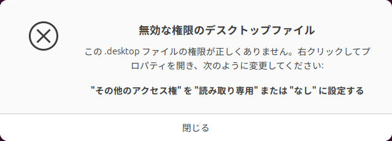
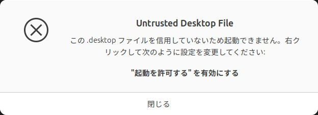

## Ubuntu 24.04作業ログ

```
$ sudo apt update
$ sudo apt upgrade
```

GUIのフリーズ判定までの時間を伸ばす。10秒くらいは待ってやらんこともない。

```
$ gsettings get org.gnome.mutter check-alive-timeout
uint32 5000
$ gsettings set org.gnome.mutter check-alive-timeout 10000
$ gsettings get org.gnome.mutter check-alive-timeout
uint32 10000
```

［設定］＞［Ubuntu Desktop］＞［Dockを自動的に隠す］

```
$ LANG=C xdg-user-dirs-update --force
$ rmdir ダウンロード
$ rmdir テンプレート$ cat /usr/share/applications/Ardour-Ardour_8.11.0.desktop 
[Desktop Entry]
Encoding=UTF-8
Version=1.0
Type=Application
Terminal=false
Exec=pw-jack /opt/Ardour-8.11.0/bin/ardour8
Name=Ardour-8.11.0
Icon=Ardour-Ardour_8.11.0
Comment=Digital Audio Workstation
Categories=AudioVideo;AudioEditing;Audio;Recorder;

$ rmdir デスクトップ
$ rmdir ドキュメント
$ rmdir ビデオ
$ rmdir ピクチャ
$ rmdir ミュージック
$ rmdir 公開
$ systemctl reboot
```

［次回から表示しない］＞［古い名前のままにする］

デスクトップアイコンが消えてミスったかと思ったけど、再起動したら復活した

```
$ sudo apt install gnome-tweaks
```

アイコンをYaru-magentaにするのが気に入っている。これ以前は[Jannomag/Yaru-Colors](https://github.com/Jannomag/Yaru-Colors)から導入していたように記憶しているが、Tweaksに統合されたのかな。

カレンダーや変換予測ポップアップは［レガシーなアプリケーション］で変更できるようだ。

ちなみにデフォルトの壁紙は`/usr/share/backgrounds`にある

```
$ find / -type f -name warty-final-ubuntu.png 2>/dev/null
/usr/share/backgrounds/warty-final-ubuntu.png
```

### Chrome

サイトから`google-chrome-stable_current_amd64.deb`をダウンロード

```
$ sudo dpkg -i google-chrome-stable_current_amd64.deb 
$ sudo apt --fix-broken install
```

起動してピンどめ。Firefoxを外す$ sudo apt --fix-broken install

✅［Google Chromeを既定のブラウザにする］
✅［使用統計データと障害レポートをGoogleに自動送信します］
Chromeにログイン
同期をオンにする

トラックパッドいらん

［設定］＞［マウスとタッチパッド］＞［タッチパッド］タブ＞［Touchpad］無効化

### RDPやってみたい

固定グローバルIPがほしい。でもお試しなので契約するほどではないかな。クラウドストレージに書いておくことでわかるようにする方法がある。

- [自宅のグローバルIPアドレスを外出先で知る #RDP - Qiita](https://qiita.com/itagagaki/items/7720d0632f9fd9c78673)

[glotlabs/gdrive](https://github.com/glotlabs/gdrive)を導入する。

これ毎回忘れる

```
$ echo 'export PATH="$HOME/.local/bin:$PATH"' >> ~/.bashrc
```

<figure>
<figcaption>~/wireguard/upload-global-ip.sh</figcaption>

```sh
#!/bin/bash
IP=$(/usr/bin/curl -s https://checkip.amazonaws.com)
/usr/bin/echo "$IP" > /tmp/global-ip.txt
/home/mukai/.local/bin/gdrive files update <FILE_ID> /tmp/global-ip.txt
```

</figure>

```
$ crontab -e
*/30 * * * * /home/mukai/wireguard/upload-global-ip.sh
```

~~VPNを構築する~~ VPNサーバーはGLM-MN3350に移した。

ファイアウォールの設定

```
$ sudo ufw enable
$ sudo ufw allow from 10.8.0.0/24 to any port 3389
```

<figure>
<figcaption>%USERPROFILE%\wireguard.conf</figcaption>

```
[Interface]
Address = 10.8.0.2/24
PrivateKey = (client_private.key の中身)

[Peer]
PublicKey = (server_public.key の中身)
Endpoint = (global_ip.txt に書かれたIP):51820
AllowedIPs = 10.8.0.0/24
```

</figure>

`10.8.0.1:3389`にアクセス……つながらない。ルーターの設定を変えないといけなかった。

「DHCP固定割当」と「ポートマッピング設定」を設定

Ubuntuの「リモートログイン」機能でやりたかった

- https://gihyo.jp/admin/serial/01/ubuntu-recipe/0819

Windowsのリモートデスクトップ接続アプリで表示すると黒い画面のまま動かなかったので断念。24.10で機能追加しているようなので、次のLTSでは使えるといいな。次回挑戦する時用のメモ

- https://qiita.com/masuminnu/items/986bc8ce769d8675cec4
  - rdp設定ファイルの`use redirection server name:i:0`を`use redirection server name:i:1`に変更する→効果なかった

リモートログインを無効化して、xrdpに切り替えた。

- https://www.diy-gedankenexperiment.jp/entry/2024/06/16/130755

```
$ sudo cp /etc/xrdp/startwm.sh /etc/xrdp/startwm.sh.orig
$ sudo vim /etc/xrdp/startwm.sh
$ cat /etc/xrdp/startwm.sh
#!/bin/sh
# xrdp X session start script (c) 2015, 2017, 2021 mirabilos
# published under The MirOS Licence

# Rely on /etc/pam.d/xrdp-sesman using pam_env to load both
# /etc/environment and /etc/default/locale to initialise the
# locale and the user environment properly.

if test -r /etc/profile; then
	. /etc/profile
fi

if test -r ~/.profile; then
	. ~/.profile
fi

# see /etc/share/xsessions/ubuntu.desktop
export GNOME_SHELL_SESSION_MODE=ubuntu
export XDG_CURRENT_DESKTOP=ubuntu:GNOME

test -x /etc/X11/Xsession && exec /etc/X11/Xsession
exec /bin/sh /etc/X11/Xsession
```

`/etc/gdm3/custom.conf`のWayland無効化は必要ないようだ。

終了時にちゃんとログアウトする。しないと実機側で「Session Already Running」と表示されて締め出されてしまう。この場合は`Ctrl+Alt+F3`でttyを切り替え、ログインして`sudo systemctl stop xrdp`と`sudo pkill -KILL -u $(whoami)`。

### SSH

VPN内に対して追加でポートを開ける。

```
$ sudo apt install openssh-server
$ sudo systemctl status ssh
$ sudo systemctl enable --now ssh  # disabledなら
$ sudo ufw allow from 10.8.0.0/24 to any port 22
```

```
PS > ssh mukai@10.8.0.1
```


### Docker

- https://docs.docker.com/engine/install/ubuntu/
- https://docs.docker.com/engine/install/linux-postinstall/ 

Docker Desktopは商用有料だが、Docker Engine自体はFLOSS。LinuxならDocker Desktopを使う理由はほぼない。Docker EngineのみをインストールしてCLIから使えばよい。

Windowsの場合は選択肢が2通りあり、WSL内で使うだけならWSLディストロ上にDocker Engineをインストールすればよい。Windows側から（not WSL）Dockerを使うためにはDocker Desktopが必須。この場合Dockerは専用のディストロを伴ってインストールされ、WSL Integrationによって他のディストロからも使用できるようになる。

macOSの場合はDocker Desktopの利用がほぼ必須。Docker DesktopがDocker Engineを導入するための軽量Linux VMの面倒をみる。

あとは上記の手順の通り鍵のダウンロードとパッケージのインストール。`sudo`なしで実行できるようにユーザーを`docker`グループに追加。

### GitHub CLI

https://github.com/cli/cli/blob/b642da26d0331f6e44af302a6a07eb458df38cd3/docs/install_linux.md#debian-ubuntu-linux-raspberry-pi-os-apt

```
$ gh auth login
```

gitもインストールされるっぽい（デフォルトで入っている？）

### NVM & Node.js

https://github.com/nvm-sh/nvm/tree/759f70f1967c56e0ce9b8f51a6c0b33efdea869b?tab=readme-ov-file#install--update-script

Ubuntuにはcurlは入ってなかった

```
$ source ~/.bashrc
$ nvm install 22
```

### VS Code

`code_1.97.2-1739406807_amd64.deb`をダウンロード

```
$ sudo dpkg -i code_1.97.2-1739406807_amd64.deb 
$ sudo apt --fix-broken install
```

### Inkscape

PPAある

https://inkscape.org/release/inkscape-1.4/gnulinux/ubuntu/ppa/dl/

```
sudo add-apt-repository ppa:inkscape.dev/stable
sudo apt update
sudo apt install inkscape
```

### GIMP

https://www.gimp.org/downloads/

`If available, the official package from your Unix-like distribution is the recommended method of installing GIMP!`

とのことなので

```
sudo apt install gimp
```

Make入ってなかった

```
sudo apt install make
```

pythonのvenvモジュールも入ってない

```
sudo apt install python3.12-venv
```

### Ardour

`Ardour-8.11.0-x86_64.run`をダウンロード

```
chmod +x Ardour-8.11.0-x86_64.run
./Ardour-8.11.0-x86_64.run
```

デスクトップエントリの権限が間違っている。

```
$ ls -l
合計 4
-rwxrwxrwx 1 mukai mukai 241  4月  2  2025 Ardour_8.12.0.desktop
```



```
$ chmod 755 ~/Desktop/Ardour_8.12.0.desktop
```



```
$ gio set Ardour_8.12.0.desktop metadata::trusted true
```

### Vital

https://account.vital.audio/

version 1.0.8では`undefined symbol: g_task_set_static_name`エラーが発生する（動的リンクのライブラリのバージョン不整合？）

```
VST3 module-path '/usr/lib/vst3/Vital.vst3/Contents/x86_64-linux/Vital.so'
[Info]: Scanning: /usr/lib/vst3/Vital.vst3
[ERROR]: Could not load VST3 plugin '/usr/lib/vst3/Vital.vst3/Contents/x86_64-linux/Vital.so': /lib/x86_64-linux-gnu/libsecret-1.so.0: undefined symbol: g_task_set_static_name
Cannot load VST3 module: '/usr/lib/vst3/Vital.vst3/Contents/x86_64-linux/Vital.so'
Scan Failed.
```

All downloadsからEarly access版をダウンロードする。1.5.5で確認

```
sudo dpkg -i VitalInstaller.deb
sudo apt --fix-broken install
```

読み込みに失敗している場合は［ウィンドウ］＞［プラグインマネージャ］から確認できる

### Wine

おおむね書いてある通り

https://gitlab.winehq.org/wine/wine/-/wikis/Debian-Ubuntu

```
sudo dpkg --add-architecture i386

sudo mkdir -pm755 /etc/apt/keyrings
wget -O - https://dl.winehq.org/wine-builds/winehq.key | sudo gpg --dearmor -o /etc/apt/keyrings/winehq-archive.key -

sudo wget -NP /etc/apt/sources.list.d/ https://dl.winehq.org/wine-builds/ubuntu/dists/noble/winehq-noble.sources
```

現時点ではyabridgeのために9.21にとどめなくてはいけない
https://github.com/robbert-vdh/yabridge/issues/382

```
$ apt list -a winehq-staging
一覧表示... 完了
winehq-staging/noble 10.1~noble-1 amd64
winehq-staging/noble 10.0.0~noble-1 amd64
winehq-staging/noble 10.0~rc6~noble-1 amd64
winehq-staging/noble 10.0~rc5~noble-1 amd64
winehq-staging/noble 10.0~rc4~noble-1 amd64
winehq-staging/noble 10.0~rc3~noble-1 amd64
winehq-staging/noble 10.0~rc2~noble-1 amd64
winehq-staging/noble 10.0~rc1~noble-1 amd64
winehq-staging/noble 9.22~noble-1 amd64
winehq-staging/noble 9.21~noble-1 amd64
...

$ sudo apt install --install-recommends winehq-staging=9.21~noble-1 wine-staging=9.21~noble-1 wine-staging-amd64=9.21~noble-1 wine-staging-i386=9.21~noble-1
sudo apt-mark hold winehq-staging
```

### yabridge

```
$ tar -C ~/.local/share -xavf yabridge-5.1.1.tar.gz
$ echo 'export PATH="$PATH:$HOME/.local/share/yabridge"' >> ~/.bashrc
```

### WINEPREFIXの管理

`wine-mono`パッケージのインストールを促す［Wine Monoインストーラー］ウィンドウが出現したら［インストール］を選択。「代わりにディストリビューションのパッケージを利用することをおすすめします。」ともあるが、Ubuntuにはないはず。

- https://gitlab.winehq.org/wine/wine/-/wikis/Wine-Mono
- https://packages.ubuntu.com/search?suite=noble&section=all&arch=any&keywords=wine-mono&searchon=names

```
$ mkdir ~/.wineprefixes
$ WINEPREFIX=~/.wineprefixes/Xfer_OTT_137 winecfg
$ WINEPREFIX=~/.wineprefixes/Xfer_OTT_137 wine Install_Xfer_OTT_137.exe 
$ yabridgectl add "$HOME/.wineprefixes/Xfer_OTT_137/drive_c/Program Files/Common Files/VST3"
$ yabridgectl sync
```

### Winetricks

https://github.com/Winetricks/winetricks

`Note: packaged Debian / Ubuntu winetricks versions are typically outdated, so a manual installation is recommended.`らしい

```
$ tar xvf winetricks-20250102.tar.gz
$ cd winetricks-20250102/
$ sudo make install
```

### KiKad

https://www.kicad.org/download/linux/

PPAでよいと思う。

### Flathub

https://flathub.org/setup/Ubuntu

```
sudo apt install flatpak
flatpak remote-add --if-not-exists flathub https://dl.flathub.org/repo/flathub.flatpakrepo
```

### PipeWireとJack

Ubuntu 24.04では、PipeWireは導入済み

```
mukai@mukai-ThinkPad-X1-Carbon-7th:~$ apt list --installed | grep wire

WARNING: apt does not have a stable CLI interface. Use with caution in scripts.

gstreamer1.0-pipewire/now 1.0.5-1ubuntu2 amd64 [インストール済み、1.0.5-1ubuntu3 にアップグレード可]
libpipewire-0.3-0t64/now 1.0.5-1ubuntu2 amd64 [インストール済み、1.0.5-1ubuntu3 にアップグレード可]
libpipewire-0.3-common/now 1.0.5-1ubuntu2 all [インストール済み、1.0.5-1ubuntu3 にアップグレード可]
libpipewire-0.3-modules/now 1.0.5-1ubuntu2 amd64 [インストール済み、1.0.5-1ubuntu3 にアップグレード可]
libwireplumber-0.4-0/noble,now 0.4.17-1ubuntu4 amd64 [インストール済み、自動]
pipewire-alsa/now 1.0.5-1ubuntu2 amd64 [インストール済み、1.0.5-1ubuntu3 にアップグレード可]
pipewire-audio/now 1.0.5-1ubuntu2 all [インストール済み、1.0.5-1ubuntu3 にアップグレード可]
pipewire-bin/now 1.0.5-1ubuntu2 amd64 [インストール済み、1.0.5-1ubuntu3 にアップグレード可]
pipewire-pulse/now 1.0.5-1ubuntu2 amd64 [インストール済み、1.0.5-1ubuntu3 にアップグレード可]
pipewire/now 1.0.5-1ubuntu2 amd64 [インストール済み、1.0.5-1ubuntu3 にアップグレード可]
wireless-regdb/noble-updates,noble-updates,now 2024.07.04-0ubuntu1~24.04.1 all [インストール済み、自動]
wireless-tools/noble,now 30~pre9-16.1ubuntu2 amd64 [インストール済み、自動]
wireplumber/noble,now 0.4.17-1ubuntu4 amd64 [インストール済み、自動]
```

https://note.kurodigi.com/void-pipewire/

`pw-jack`はない

```
$ pw-jack
コマンド 'pw-jack' が見つかりません。次の方法でインストールできます:
sudo apt install pipewire-jack
$ sudo apt install pipewire-jack
$ pw-jack -p 512 /opt/Ardour-8.11.0/bin/ardour8
```

https://discourse.ardour.org/t/ardour-8-2-8-4-audio-setup-pipewire-jack/109952

ランチャーにも登録しちゃう

```
$ cat /usr/share/applications/Ardour-Ardour_8.11.0.desktop 
[Desktop Entry]
Encoding=UTF-8
Version=1.0
Type=Application
Terminal=false
Exec=pw-jack /opt/Ardour-8.11.0/bin/ardour8
Name=Ardour-8.11.0
Icon=Ardour-Ardour_8.11.0
Comment=Digital Audio Workstation
Categories=AudioVideo;AudioEditing;Audio;Recorder;
```

### Ardourのメモリ制限を解除

https://forum.manjaro.org/t/maximum-amount-of-locked-memory/34528

```
sudo groupadd audio
sudo usermod -aG audio $USER
echo '@audio - memlock unlimited' | sudo tee /etc/security/limits.d/audio.conf
```

### QEMU

- https://gist.github.com/Informatic/49bd034d43e054bd1d8d4fec38c305ec
- https://orebibou.com/ja/home/201905/20190527_001/

~~多分MSDMだけでいい~~ 全部含めたほうがよさそう。

```
mukai@mukai-ThinkPad-X1-Carbon-7th:~$ ls -la .win11
合計 28
drwxrwxr-x+  2 libvirt-qemu kvm   4096  3月 11 21:29 .
drwxr-x---+ 31 mukai        mukai 4096  3月 11 22:39 ..
-rw-r--r--   1 libvirt-qemu kvm     85  3月 11 21:29 msdm.bin
-rwxrwxr-x   1 libvirt-qemu kvm    323  3月 11 21:29 slic-dump
-rw-r--r--   1 libvirt-qemu kvm    374  3月 11 21:29 slic.bin
-rw-r--r--   1 libvirt-qemu kvm     66  3月 11 21:29 smbios_type_0.bin
-rw-r--r--   1 libvirt-qemu kvm    165  3月 11 21:29 smbios_type_1.bin
```

```
$ sudo cp /etc/apparmor.d/abstractions/libvirt-qemu /etc/apparmor.d/abstractions/libvirt-qemu.org
$ sudo nano /etc/apparmor.d/abstractions/libvirt-qemu
$ tail -n 5 /etc/apparmor.d/abstractions/libvirt-qemu
  # Support for this override will be removed in a future release
  ### DEPRECATED ###
  include if exists <local/abstractions/libvirt-qemu>

/home/mukai/.win11/** r,
$ sudo apparmor_parser -r /etc/apparmor.d/abstractions/libvirt-qemu
AppArmor parser error for /etc/apparmor.d/abstractions/libvirt-qemu in profile /etc/apparmor.d/abstractions/openssl at line 13: syntax error, unexpected TOK_MODE, expecting TOK_OPEN
```

なんかエラー出てるけど直接は関係なさそう。

virt-managerで「インストールの前に設定をカスタマイズする」を有効にしてXMLを編集する
