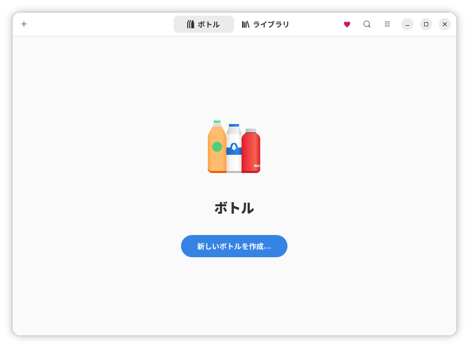
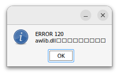
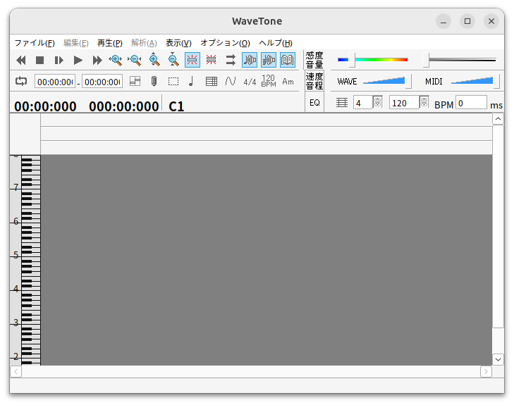
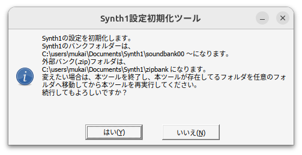

## Bottles

https://usebottles.com/

Flatpakからインストールするように指示されている[^1]。Flatpakをインストールしていなければ手順[^2]通りインストールする。GNOME Software FlatpakプラグインはUbuntuが提供しているアプリセンターと噛み合わせが悪いことが説明されている。そもそも私は使っていないからインストールは不要そうだ。

[^1]: https://docs.usebottles.com/getting-started/installation
[^2]: https://flathub.org/en/setup/Ubuntu

```
$ sudo apt install flatpak
$ flatpak remote-add --if-not-exists flathub https://dl.flathub.org/repo/flathub.flatpakrepo
$ systemctl reboot

$ flatpak install flathub com.usebottles.bottles
$ flatpak run com.usebottles.bottles
```

中華フォントっぽい。


おそらくこれはflatpakサンドボックスがシステムのフォントを正しく参照できていない。以下のような情報が見つかった。

- https://github.com/flatpak/flatpak/issues/5425
- https://okutom.hatenablog.com/entry/2024/11/07/204055

```
$ mkdir -p ~/.config/fontconfig/conf.d
$ cp /etc/fonts/fonts.conf ~/.config/fontconfig/fonts.conf
$ cp -L /etc/fonts/conf.d/*.conf ~/.config/fontconfig/conf.d/
$ tree ~/.config/fontconfig/
/home/mukai/.config/fontconfig/
├── conf.d
│   ├── 10-hinting-slight.conf
│   ├── 10-scale-bitmap-fonts.conf
│   ├── 10-sub-pixel-rgb.conf
...
│   ├── 80-delicious.conf
│   ├── 90-synthetic.conf
│   └── 99-language-selector-zh.conf
└── fonts.conf

2 directories, 63 files
$ sudo flatpak override --filesystem=xdg-config/fontconfig:ro

$ rm -rf ~/.cache/fontconfig
$ rm -rf ~/.var/app/*/cache/fontconfig

$ flatpak run com.usebottles.bottles
```



デフォルトっぽい設定でWINEPREFIXを……Bottlesでは「ボトル」と言うらしい、ボトルを作成してみる。

```
名前：test
アプリケーション
ランナー：soda-9.0-1
ボトルのディレクトリ：（デフォルト）
```

Browse C:/ driveから表示すると、`/home/mukai/.var/app/com.usebottles.bottles/data/bottles/bottles/test/drive_c`が表示される。WINEPREFIXである`/home/mukai/.var/app/com.usebottles.bottles/data/bottles/bottles/test`には`bottle.yml`がある。

[microfortnight/yabridge-bottles-wineloader](https://github.com/microfortnight/yabridge-bottles-wineloader)によると、Wineバイナリの実パスは以下のパスになる。

```
$ yq -r ".Runner" /home/mukai/.var/app/com.usebottles.bottles/data/bottles/bottles/test/bottle.yml 
soda-9.0-1
$ ls ~/.var/app/com.usebottles.bottles/data/bottles/runners/soda-9.0-1/bin/
function_grep.pl  regedit   wine-preloader        wine64-preloader  winecfg      winedump  winemaker   wmc
msidb             regsvr32  wine-tkg              wine64-tkg        wineconsole  winefile  winemine    wrc
msiexec           widl      wine-tkg-interactive  wineboot          winecpp      wineg++   winepath
notepad           wine      wine64                winebuild         winedbg      winegcc   wineserver
```

素直に動きそうなWindowsアプリを実行してみる。

- https://ackiesound.ifdef.jp/download.html

`~/Downloads/wavetone274.zip`にダウンロードして解凍。`wavetone.exe`が現れる。歯車マークの「Run executable in "test"」から`~/Downloads/wavetone274/wavetone.exe`を実行



まずは豆腐を直したい。Bottlesでは「依存関係」（dependencies）という概念を導入して、Winetricksの機能を自前で用意している。とはいえ内容の出自はWinetricksで、基本的には名称もWinetricksと共通していると考えてよいようだ。testの>アイコン（詳細）＞依存関係から「cjkfonts」をインストールする。


awlib.dllは自身のdata/awlib.dllに存在するので、単にアクセスできないという問題だろう。ディレクトリをWINEPREFIX内に移動する。

```
$ mv ~/Downloads/wavetone274 /home/mukai/.var/app/com.usebottles.bottles/data/bottles/bottles/test/drive_c/users/steamuser/Documents/
```

テキスト座標などがちょっと怪しいけど、起動は問題なさそうだ。



BottlesにはCLIもあるが、依存関係のインストールなどは特にできないらしい。現時点ではあまり使いみちがなさそう。

- https://docs.usebottles.com/advanced/cli

```
$ flatpak run --command=bottles-cli com.usebottles.bottles list bottles
16:22:16 (INFO) Forcing offline mode 
Found 1 bottles:
- test
$ flatpak run --command=bottles-cli com.usebottles.bottles tools --bottle test winecfg
16:23:10 (INFO) Forcing offline mode 
wineserver: using server-side synchronization.
```

### yabridgeでのBottles利用

[robbert-vdh/yabridge](https://github.com/robbert-vdh/yabridge)自体にはWineバイナリを管理する機能はないのだが、Bottlesとローダースクリプトによって、WINEPREFIXごとに実行するWineを切り替えることができる。その方法を紹介しているのが[microfortnight/yabridge-bottles-wineloader](https://github.com/microfortnight/yabridge-bottles-wineloader)。

- https://github.com/robbert-vdh/yabridge/blob/a69072ef513399414ed53564766ce7ad5f419dcf/tools/yabridgectl/src/util.rs#L367
- https://github.com/robbert-vdh/yabridge/blob/a69072ef513399414ed53564766ce7ad5f419dcf/src/plugin/utils.cpp#L108

<details>
<summary>wineloader.sh, <code>373d49193e16d4d81eb58f7cb08b82c66f7e6dca</code>, Unlicense (public domain)</summary>

```sh
#!/bin/bash
YQ=$(command -v yq)
if [ -z "$YQ" ]; then
  echo "Error: yq is not installed." >&2
  exit 1
fi

SYSTEM_WINE=$(command -v wine)

call_system_wine() {
    if [ -n "$SYSTEM_WINE" ]; then
        exec "$SYSTEM_WINE" "$@"
    else
        echo "Error: system wine is not installed." >&2
        exit 1
    fi
}

# If bottle.yml exists in the prefix, use the "runner" specified there
if [[ -e "${WINEPREFIX}/bottle.yml" ]]; then
    # Parse runner and path from bottle.yml
    RUNNER=$(yq -r ".Runner" "${WINEPREFIX}/bottle.yml")
    BOTTLE_PATH=$(yq -r ".Path" "${WINEPREFIX}/bottle.yml")
    BOTTLE_PATH=$(basename "$BOTTLE_PATH")

    # Locate BOTTLES_ROOT
    if [[ -d "$HOME/.var/app/com.usebottles.bottles/data/bottles/bottles/$BOTTLE_PATH" ]]; then
        BOTTLES_ROOT="$HOME/.var/app/com.usebottles.bottles/data/bottles/"
    elif [[ -d "$HOME/.local/share/bottles/bottles/$BOTTLE_PATH" ]]; then
        BOTTLES_ROOT="$HOME/.local/share/bottles"
    else
        echo "Error: BOTTLES_ROOT not found." >&2
        exit 1
    fi

    # Bottles uses "sys-*" (e.g. "sys-wine-9.0") internally to refer to system wine
    # Also fall back to system wine if runner is empty.
    if [[ -z "$RUNNER" || "$RUNNER" == sys-* ]]; then
        call_system_wine "$@"

    else
        exec "$BOTTLES_ROOT/runners/$RUNNER/bin/wine" "$@"

    fi

# Uncomment below, to assign a custom wine version to this wineprefix
#elif [ "$WINEPREFIX" == "/path/to/your/wineprefix" ]; then
#    exec /path/to/your/bin/wine "$@"

else
    call_system_wine "$@"

fi
```

</details>

ハンバーガーメニューのPreferences>Runnersから追加のランナーをインストールできる。[yabridge#382](https://github.com/robbert-vdh/yabridge/issues/382)の影響で、yabridge-bottles-wineloaderではkron4ek-wine-9.21-staging-tkg-amd64の使用を推奨している。[Kron4ek](https://github.com/Kron4ek)氏が配布している、パッチを複数適用したバイナリということ？

まずは新たなボトルを作成

```
名前：VST Plugins Default
アプリケーション
ランナー：kron4ek-wine-9.21-staging-tkg-amd64
ボトルのディレクトリ：（デフォルト）
```

どうせフォントは使うのでallfontsとcjkfontsはインストール

Synth1をインストールしてみる

- https://daichilab.sakura.ne.jp/softsynth/

ダウンロードしたSynth1V113beta3.zipを解凍して移動

```
$ mkdir -p ~/.var/app/com.usebottles.bottles/data/bottles/bottles/VST-Plugins-Default/drive_c/Program\ Files/VSTPlugIns
$ mkdir -p ~/.var/app/com.usebottles.bottles/data/bottles/bottles/VST-Plugins-Default/drive_c/Program\ Files/Common\ Files/VST3

$ mv ~/Downloads/Synth1V113beta3/Synth1 ~/.var/app/com.usebottles.bottles/data/bottles/bottles/VST-Plugins-Default/drive_c/users/mukai/Documents/
```

[ドキュメント](https://daichilab.sakura.ne.jp/softsynth/synmanu/readme.html#inst)によると、配置後に設定初期化が必要。

```
$ flatpak run --command=bottles-cli com.usebottles.bottles run --bottle "VST Plugins Default" --executable ~/.var/app/com.usebottles.bottles/data/bottles/bottles/VST-Plugins-Default/drive_c/users/mukai/Documents/Synth1/initsettings.exe
```



```
$ cp ~/.var/app/com.usebottles.bottles/data/bottles/bottles/VST-Plugins-Default/drive_c/users/mukai/Documents/Synth1/Synth1\ VST64.dll ~/.var/app/com.usebottles.bottles/data/bottles/bottles/VST-Plugins-Default/drive_c/Program\ Files/VSTPlugIns/
```

yabridgeの通常の使い方でディレクトリを追加する。

```
$ yabridgectl add /home/mukai/.var/app/com.usebottles.bottles/data/bottles/bottles/VST-Plugins-Default/drive_c/Program\ Files/VSTPlugIns
$ yabridgectl add /home/mukai/.var/app/com.usebottles.bottles/data/bottles/bottles/VST-Plugins-Default/drive_c/Program\ Files/Common\ Files/VST3
$ yabridgectl sync
```

yabridge-bottles-wineloaderでは`$HOME/.local/bin/wineloader.sh`に置くことになっているが、このローダースクリプトはyabridgeでだけ使えればよい……はず。yabridgeのインストール先と同じ場所に置くことにした。

```
$ curl -L https://raw.githubusercontent.com/microfortnight/yabridge-bottles-wineloader/373d49193e16d4d81eb58f7cb08b82c66f7e6dca/wineloader.sh -o ~/.local/share/yabridge/wineloader.sh
$ chmod +x ~/.local/share/yabridge/wineloader.sh
$ cat ~/Desktop/Ardour_8.12.0.desktop 
[Desktop Entry]
Encoding=UTF-8
Version=1.0
Type=Application
Terminal=false
Exec=env WINELOADER=/home/mukai/.local/share/yabridge/wineloader.sh pw-jack /opt/Ardour-8.12.0/bin/ardour8
Name=Ardour-8.12.0
Icon=Ardour-Ardour_8.12.0
Comment=Digital Audio Workstation
Categories=AudioVideo;AudioEditing;Audio;Recorder;
```

システムのアプリ一覧のエントリは`/usr/share/applications/Ardour-Ardour_8.12.0.desktop`

Ardourではウィンドウ＞プラグインマネージャから確認する。デフォルトでは`$HOME/.vst`がスキャン一覧に入っていないので要注意。

狙ったWine（`9.21.r0.gf03d32e3 ( TkG Staging Esync Fsync )`）が使用されているのがログからわかる。

```
[Info]: Scanning: /home/mukai/.vst/yabridge/Synth1 VST64.so
20:43:25 [Synth1 VST64-EHLOTcil] Initializing yabridge version 5.1.1
20:43:25 [Synth1 VST64-EHLOTcil] library:       '/home/mukai/.local/share/yabridge/libyabridge-vst2.so'
20:43:25 [Synth1 VST64-EHLOTcil] host:          '/home/mukai/.local/share/yabridge/yabridge-host.exe'
20:43:25 [Synth1 VST64-EHLOTcil] plugin:        '/home/mukai/.var/app/com.usebottles.bottles/data/bottles/bottles/VST-Plugins-Default/drive_c/Program Files/VSTPlugIns/Synth1 VST64.dll'
20:43:25 [Synth1 VST64-EHLOTcil] plugin type:   'VST2'
20:43:25 [Synth1 VST64-EHLOTcil] realtime:      'yes'
20:43:25 [Synth1 VST64-EHLOTcil] sockets:       '/run/user/1000/yabridge-Synth1 VST64-EHLOTcil'
20:43:25 [Synth1 VST64-EHLOTcil] wine prefix:   '/home/mukai/.var/app/com.usebottles.bottles/data/bottles/bottles/VST-Plugins-Default'
20:43:25 [Synth1 VST64-EHLOTcil] wine version:  '9.21.r0.gf03d32e3 ( TkG Staging Esync Fsync )'
20:43:25 [Synth1 VST64-EHLOTcil] 
20:43:25 [Synth1 VST64-EHLOTcil] config from:   '<defaults>'
20:43:25 [Synth1 VST64-EHLOTcil] hosting mode:  'individually, 64-bit'
20:43:25 [Synth1 VST64-EHLOTcil] other options: '<none>'
20:43:25 [Synth1 VST64-EHLOTcil] 
20:43:25 [Synth1 VST64-EHLOTcil] Enabled features:
20:43:25 [Synth1 VST64-EHLOTcil] - bitbridge support
20:43:25 [Synth1 VST64-EHLOTcil] - CLAP support
20:43:25 [Synth1 VST64-EHLOTcil] - VST3 support
20:43:25 [Synth1 VST64-EHLOTcil] 
20:43:25 [Synth1 VST64-EHLOTcil] [Wine STDERR] wineserver: using server-side synchronization.
20:43:25 [Synth1 VST64-EHLOTcil] [Wine STDERR] 002c:fixme:winediag:loader_init Wine TkG (staging) 9.21 is a testing version containing experimental patches.
20:43:25 [Synth1 VST64-EHLOTcil] [Wine STDERR] 002c:fixme:winediag:loader_init Please don't report bugs about it on winehq.org and use https://github.com/Frogging-Family/wine-tkg-git/issues instead.
20:43:26 [Synth1 VST64-EHLOTcil] [Wine STDERR] 002c:err:wineboot:process_run_key Error running cmd L"C:\\windows\\system32\\winemenubuilder.exe -a -r" (2).
20:43:26 [Synth1 VST64-EHLOTcil] [Wine STDERR] 0070:err:wineusb:DriverEntry Failed to initialize Unix library, status 0xc0000135.
20:43:26 [Synth1 VST64-EHLOTcil] [Wine STDERR] 0070:err:ntoskrnl:ZwLoadDriver failed to create driver L"\\Registry\\Machine\\System\\CurrentControlSet\\Services\\wineusb": c0000135
20:43:26 [Synth1 VST64-EHLOTcil] [Wine STDERR] 0034:fixme:service:scmdatabase_autostart_services Auto-start service L"wineusb" failed to start: 126
20:43:26 [Synth1 VST64-EHLOTcil] [Wine STDERR] Initializing yabridge host version 5.1.1
20:43:26 [Synth1 VST64-EHLOTcil] [Wine STDERR] Preparing to load VST2 plugin at '/home/mukai/.var/app/com.usebottles.bottles/data/bottles/bottles/VST-Plugins-Default/drive_c/Program Files/VSTPlugIns/Synth1 VST64.dll'
20:43:27 [Synth1 VST64-EHLOTcil] [Wine STDERR] 0128:fixme:ver:GetCurrentPackageId (000000000011EDA0 0000000000000000): stub
20:43:27 [Synth1 VST64-EHLOTcil] [Wine STDERR] Finished initializing '/home/mukai/.var/app/com.usebottles.bottles/data/bottles/bottles/VST-Plugins-Default/drive_c/Program Files/VSTPlugIns/Synth1 VST64.dll'
[Info]: Found Plugin: 'sV1S' Synth1 VSTi
[Info]: Saved VST2 plugin cache to /home/mukai/.cache/ardour8/vst/24347eb6cc2d884a66c11af6d7490d79ced432fc-x64.v2i
```
