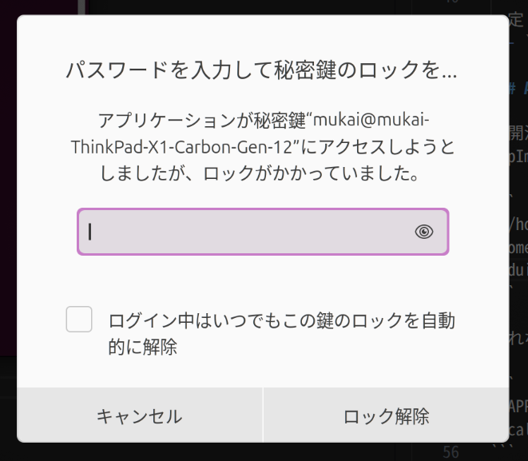

## 鍵認証によるSSH接続をセットアップする

まずクライアント（接続元）で鍵ペアを作成する。

```
$ ssh-keygen -t ed25519
Generating public/private ed25519 key pair.
Enter file in which to save the key (/home/mukai/.ssh/id_ed25519): 
Enter passphrase (empty for no passphrase): 
Enter same passphrase again: 
Your identification has been saved in /home/mukai/.ssh/id_ed25519
Your public key has been saved in /home/mukai/.ssh/id_ed25519.pub
...

$ ls -l .ssh/id_ed25519*
-rw------- 1 mukai mukai 484  1月 14 09:20 .ssh/id_ed25519
-rw-r--r-- 1 mukai mukai 119  1月 14 09:15 .ssh/id_ed25519.pub
```

- `-t`（key-type）：高速でセキュアな楕円曲線系のEd25519を明示するとよい
- `-C`（comment）：つけておくとよい
- 対話で要求されるパスフレーズ：つけておくとよい（後述）
  - あとから変更する場合`ssh-keygen -p -f ~/.ssh/id_ed25519`

続いて公開鍵をホスト（接続先）にコピーする。

```
$ ssh-copy-id -i ~/.ssh/id_ed25519.pub <user>@<host>
```

- これはホストの`~/.ssh/authorized_keys`ファイルの末尾に追記するのと同じこと。ただし権限を適切に設定したり、よりセキュアな方法であることを期待できる

鍵認証でログインできることを確認する。パスワードを要求されなければ成功。

```
$ ssh <user>@<host>  # または明示して ssh -i ~/.ssh/id_ed25519 <user>@<host>
```

### パスフレーズ

秘密鍵が漏れるとアクセスし放題になってしまう。これを防ぐために、秘密鍵自体をパスフレーズで暗号化できる。

```
$ ssh-keygen -p -f ~/.ssh/id_ed25519
```

都度パスフレーズを入力したり、`eval "$(ssh-agent -s)"`（ssh-agentを起動し、環境変数を表示して現在のシェルでeval）→`ssh-add ~/.ssh/id_ed25519`で暗号化を解除して使う。GNOMEデスクトップでログイン中はssh-agentが自動でkeyringに紐付いて起動している。

```
$ echo $SSH_AUTH_SOCK
/run/user/1000/keyring/ssh
```



同じマシンでも例えばttyログインだと

```
$ echo $SSH_AUTH_SOCK

$ ssh <user>@<host>
Enter passphrase for key '/home/mukai/.ssh/id_ed25519':
```

### パスワードログインを無効化

（TODO）
