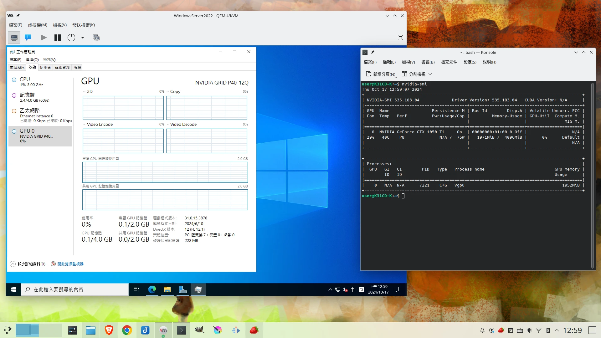
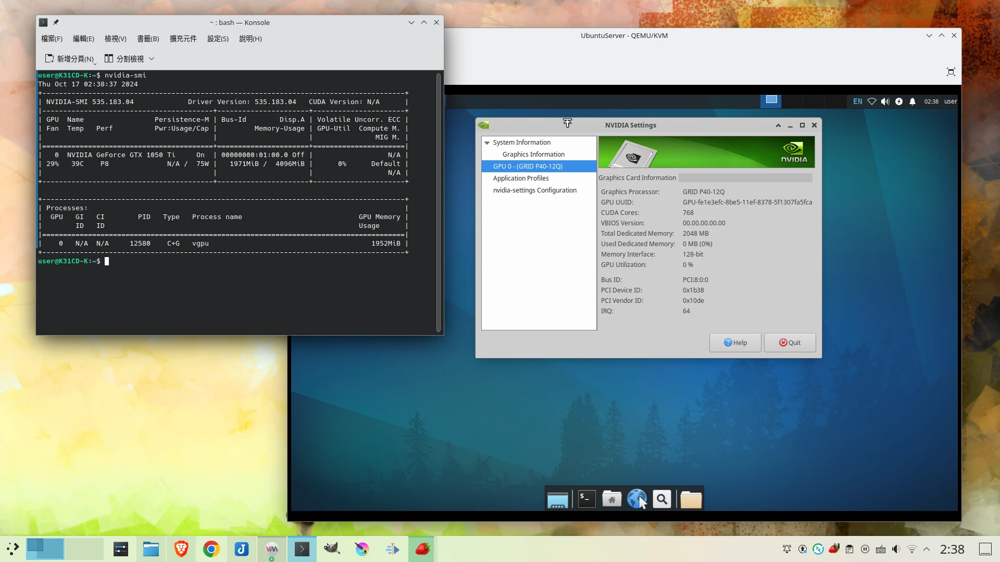
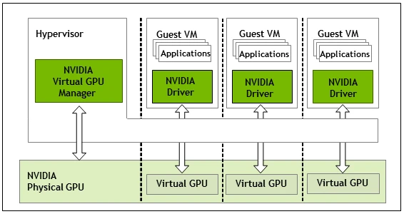
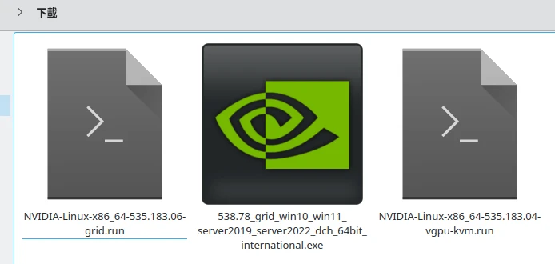
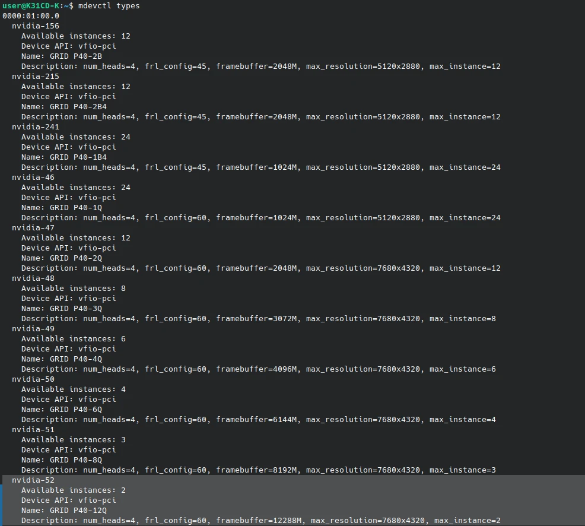
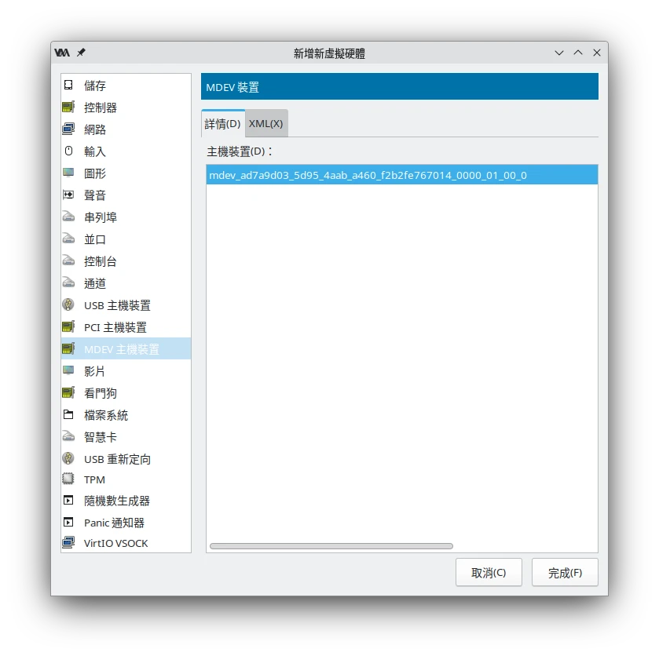
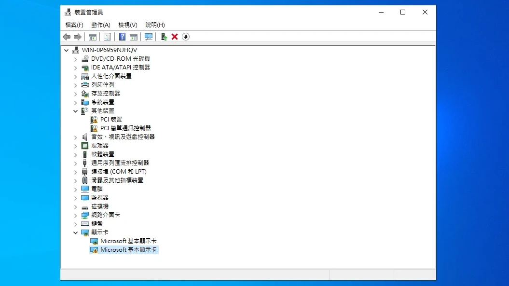
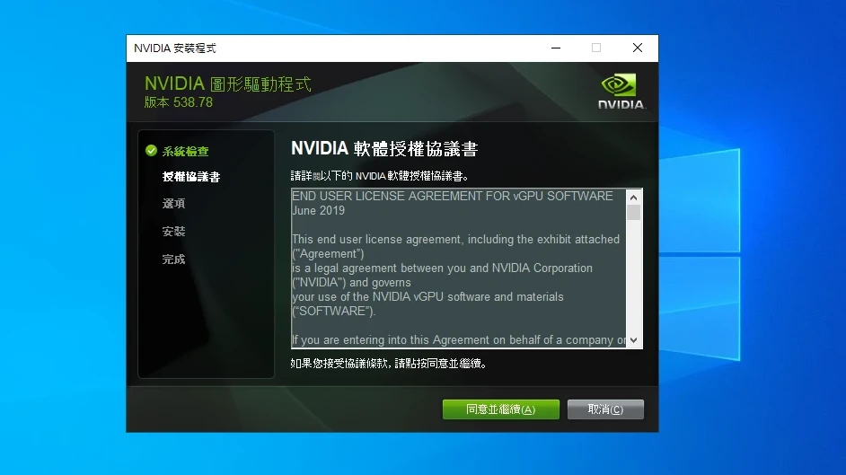
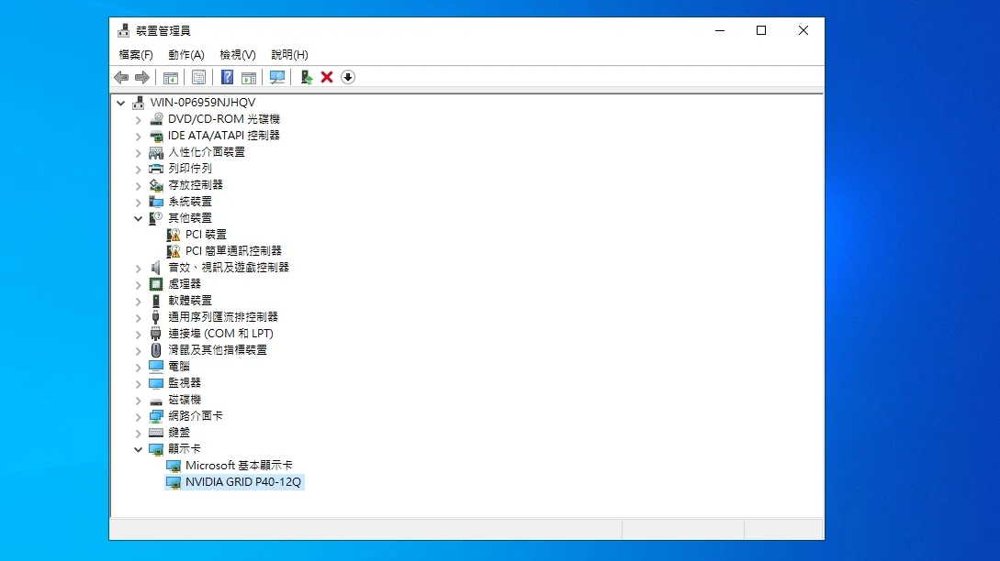

## （私家訳）Ubuntuでvgpu_unlockを使用してNVIDIA vGPUをアンロックし、QEMU/KVM仮想マシンでGPU仮想化を有効にする

<details>
<summary>原文</summary>

Ubuntu使用vgpu_unlock解鎖NVIDIA vGPU，給QEMU/KVM虛擬機啟用GPU虛擬化

</details>

- https://ivonblog.com/posts/ubuntu-libvirt-nvidia-vgpu-unlock/
  - 投稿日：2024年10月17日
  - 閲覧日：2026年3月10日

vGPU（Virtual GPU）はNvidiaが提供するGPU仮想化技術で、Linux上の1枚のGPUグラフィックスカードを複数の仮想マシンに割り当てることができ、これによりQEMU/KVM仮想マシンのグラフィックス性能を向上させることができます。

<details>
<summary>原文</summary>

vGPU (Virtual GPU) 為Nvidia推出的GPU虛擬化技術，能夠將Linux上的一張GPU顯示卡分配給多個虛擬機使用，如此一來可提昇QEMU/KVM虛擬機的圖形效能。

</details>

図例、LinuxホストマシンとWindows仮想マシンがGPUを共有

<details>
<summary>原文</summary>

圖例，Linux宿主機與Windows虛擬機共享GPU

</details>



図例、LinuxホストマシンとLinux仮想マシンがGPUを共有

<details>
<summary>原文</summary>

圖例，Linux宿主機與Linux虛擬機共享GPU

</details>



「GPU仮想化」と「GPUパススルー」は異なります。後者はLinuxホストマシンのGPUを直接封印し、VFIOを通じて仮想マシンに割り当てて使用するもので、一度に1つの仮想マシンしかGPUを使用できず、ホストマシンはGPUにアクセスできません。

<details>
<summary>原文</summary>

「GPU虛擬化」跟「GPU直通」不一樣，後者是直接將Linux宿主機的GPU封印，透過VFIO分配給虛擬機使用，一次只能有一個虛擬機使用GPU，宿主機無法存取GPU。

</details>

- 関連記事：[Ubuntu Nvidia GPUパススルーWindows QEMU/KVM仮想マシン](https://ivonblog.com/posts/ubuntu-gpu-passthrough/)

<details>
<summary>原文</summary>

- 相關文章：[Ubuntu Nvidia GPU直通Windows QEMU/KVM虛擬機](https://ivonblog.com/posts/ubuntu-gpu-passthrough/)

</details>

GPU仮想化を採用すれば、ホストマシンと仮想マシンが同じGPUのリソースを共有できるようになります。ホストマシンのGPUを複数の仮想マシンに分割して使用でき、これにより複数の仮想マシンでCUDAを実行できるようになります。

<details>
<summary>原文</summary>

若是採用GPU虛擬化的話，宿主機就能和虛擬機共享同一個GPU的資源了。宿主機的GPU可以分割給多個虛擬機使用，這樣就能讓多個虛擬機跑CUDA啦。

</details>



<details>
<summary>原文</summary>

Nvidia官方發表的vGPU原理圖

</details>

ただし、現在Nvidia公式ではvGPU機能をサーバーGPUにのみ開放しており、ライセンスの購入が必要です。一般消費者向けのNvidia GPUはハードウェア的にはvGPUをサポートしていますが、vGPUは使用できません。そのため、サードパーティ開発者が作成した「vgpu_unlock」プログラムを使用してこの機能をアンロックし、自前で構築した「FastAPI-DLS」サーバーでNvidia vGPUのライセンスを取得する必要があります。

<details>
<summary>原文</summary>

不過，目前Nvidia官方僅將vGPU功能開放給伺服器GPU使用，而且需要購買授權。一般消費級的Nvidia GPU雖然硬體支援vGPU，但是vGPU是無法使用的。故我們得使用第三方開發者製作的「vgpu_unlock」程式解鎖該功能，並用自架的「FastAPI-DLS」伺服器取得Nvidia vGPU的授權。

</details>

ネット上のこの分野の操作チュートリアルの多くはProxmoxを使用していますが、私はNvidiaとUbuntuの公式ドキュメントを参考に、Ubuntu + QEMU/KVM + Libvirtのバージョンに変換しました。Ubuntuデスクトップ版ユーザーの参考になれば幸いです。

<details>
<summary>原文</summary>

網路上有關這方面操作的教學多半是跑Proxmox，我參考了Nvidia和Ubuntu的官方文件，將其轉化為Ubuntu + QEMU/KVM + Libvirt的版本，可供Ubuntu桌面版用戶參考。

</details>

有効化の全プロセスは少し面倒で、Linux Nvidiaドライバのインストールとアンインストール方法に精通している必要があります。そうでなければ、失敗した場合にシステム全体を再インストールしなければならなくなる可能性があります。

<details>
<summary>原文</summary>

整個啟用過程有點麻煩，你需要很熟悉Linux Nivdia驅動的安裝與解除安裝方式，不然的話搞砸了可能得整個系統要重裝。

</details>


> 訳注：「これは何の料理だ？」→「（手順が複雑すぎて）何これ？」という意味のネットスラング。

### 1. vgpu_unlockがサポートするGPU

<details>
<summary>原文</summary>

1\. vgpu_unlock支援的GPU

</details>

現在vgpu_unlockがサポートするGPUの型番は以下の通りです：

<details>
<summary>原文</summary>

目前vgpu_unlock支援的GPU型號為：

</details>

- Maxwellアーキテクチャ (GTX 9xx, Quadro Mxxxx, Tesla Mxx)、GTX 970を除く
- Pascalアーキテクチャ (GTX 10xx, Quadro Pxxxx, Tesla Pxx)
- Turingアーキテクチャ (GTX 16xx, RTX 20xx, Txxxx)

<details>
<summary>原文</summary>

- Maxwell架構 (GTX 9xx, Quadro Mxxxx, Tesla Mxx)，GTX 970除外
- Pascal架構 (GTX 10xx, Quadro Pxxxx, Tesla Pxx)
- Turing架構 (GTX 16xx, RTX 20xx, Txxxx)

</details>

Ampereアーキテクチャ (RTX30xx) 以上のGPUはまだサポートされていません。

<details>
<summary>原文</summary>

Ampere架構 (RTX30xx) 以上的GPU尚未支援。

</details>

### 2. テスト環境

<details>
<summary>原文</summary>

2\. 測試環境

</details>

- ホストマシン：Ubuntu 24.04 LTS
- Linuxカーネルバージョン：6.5.0-35-generic
- CPU：Intel® Core™ i5-7400
- GPU 1：Intel® UHD Graphics 630
- GPU 2：NVIDIA GeForce GTX 1050 Ti
- Nvidia vGPUドライババージョン：535.183.04
- 仮想マシンOS 1：Ubuntu Server 24.04 LTS
- 仮想マシンOS 2：Windows Server 2022

<details>
<summary>原文</summary>

- 宿主機：Ubuntu 24.04 LTS
- Linux 核心版本：6.5.0-35-generic
- CPU：Intel® Core™ i5-7400
- GPU 1：Intel® UHD Graphics 630
- GPU 2：NVIDIA GeForce GTX 1050 Ti
- Nvidia vGPU驅動版本：535.183.04
- 虛擬機系統1：Ubuntu Server 24.04 LTS
- 虛擬機系統2：Windows Server 2022

</details>

vGPUを有効化した後、一時的にPCの画面が表示されなくなる可能性があるため、vGPU有効化後は内蔵GPUの使用またはSSHでのログインに切り替える必要があります。

<details>
<summary>原文</summary>

由於vGPU啟用後可能會暫時讓電腦螢幕沒畫面，因此在啟用vGPU之後就要改成使用內顯或者SSH登入了。

</details>

### 3. QEMU/KVMとLibvirtのインストール

<details>
<summary>原文</summary>

3\. 安裝QEMU/KVM與Libvirt

</details>

まず仮想化パッケージをセットアップしてください。

<details>
<summary>原文</summary>

請先設定好虛擬化套件。

</details>

参考：[UbuntuにQEMU/KVMとVirt Manager仮想マシンマネージャをインストール](https://ivonblog.com/posts/ubuntu-virt-manager/)

<details>
<summary>原文</summary>

參考：[Ubuntu安裝QEMU/KVM和Virt Manager虛擬機管理員](https://ivonblog.com/posts/ubuntu-virt-manager/)

</details>

### 4. IOMMUとVFIOの有効化

<details>
<summary>原文</summary>

4\. 啟用IOMMU與VFIO

</details>

1. GRUBブートオプションを編集
   ```bash
   sudo vim /etc/default/grub
   ```
2. Intel CPUの場合、`GRUB_CMDLINE_LINUX_DEFAULT`の後に以下の内容を追加し、IOMMUを有効化
   ```bash
   GRUB_CMDLINE_LINUX_DEFAULT="quiet splash intel_iommu=on"
   ```
3. 起動時にVFIOカーネルモジュールを読み込むよう設定
   ```bash
   echo -e "vfio\nvfio_iommu_type1\nvfio_pci\nvfio_virqfd" | sudo tee -a  /etc/modules
   ```
4. Nvidiaオープンソースドライバをブラックリストに追加
   ```bash
   echo "blacklist nouveau" | sudo tee -a /etc/modprobe.d/blacklist.conf
   ```
5. 現在のシステムのすべてのNvidiaドライバを削除
   ```bash
   sudo apt purge *nvidia*
   ```
6. initramfsとGRUBを更新して再起動
   ```bash
   sudo update-initramfs -u -k all

   sudo update-grub

   sudo reboot
   ```
7. PCのUEFI設定に入り、内蔵GPU優先で起動するよう設定。

<details>
<summary>原文</summary>

1. 編輯GRUB開機選項
   ```bash
   sudo vim /etc/default/grub
   ```
2. 針對Intel CPU，在`GRUB_CMDLINE_LINUX_DEFAULT`後面加入以下內容，啟用IOMMU
   ```bash
   GRUB_CMDLINE_LINUX_DEFAULT="quiet splash intel_iommu=on"
   ```
3. 設定開機載入VFIO核心模組
   ```bash
   echo -e "vfio\nvfio_iommu_type1\nvfio_pci\nvfio_virqfd" | sudo tee -a  /etc/modules
   ```
4. 將Nvidia開源驅動加入黑名單
   ```bash
   echo "blacklist nouveau" | sudo tee -a /etc/modprobe.d/blacklist.conf
   ```
5. 刪除目前系統的全部Nvidia驅動
   ```bash
   sudo apt purge *nvidia*
   ```
6. 更新initramfs和GRUB並重開機
   ```bash
   sudo update-initramfs -u -k all

   sudo update-grub

   sudo reboot
   ```
7. 進入電腦的UEFI設定，設定為以內顯優先開機。

</details>

### 5. vgpu_unlockアンロックサービスの設定

<details>
<summary>原文</summary>

5\. 設定vgpu_unlock解鎖服務

</details>

Matthew Bilkerの「vgpu_unlock-rs」はJonathan Johanssonのvgpu_unlockをベースに開発されたプログラムで、GPUをvGPU対応の型番に偽装することができます。

<details>
<summary>原文</summary>

Matthew Bilker的「vgpu_unlock-rs」為基於Jonathan Johansson的vgpu_unlock所開發的程式，它能夠將GPU偽裝成為支援vGPU的型號。

</details>

1. Rustをインストールし、アンロックツールvgpu_unlock-rsをコンパイル
   ```bash
   cd ~

   curl --proto '=https' --tlsv1.3 https://sh.rustup.rs -sSf | sh

   source $HOME/.cargo/env

   git clone https://github.com/mbilker/vgpu_unlock-rs.git

   cd vgpu_unlock-rs

   cargo build --release

   cd ..

   sudo mv gpu_unlock-rs /opt
   ```
2. vgpu_unlock-rsに必要なファイルを作成
   ```bash
   sudo mkdir -p /etc/vgpu_unlock

   sudo touch /etc/vgpu_unlock/profile_override.toml
   ```
3. 起動時に自動起動するSystemdサービスを作成
   ```bash
   sudo mkdir /etc/systemd/system/{nvidia-vgpud.service.d,nvidia-vgpu-mgr.service.d}

   echo -e "[Service]\nEnvironment=LD_PRELOAD=/opt/vgpu_unlock-rs/target/release/libvgpu_unlock_rs.so" | sudo tee -a /etc/systemd/system/nvidia-vgpud.service.d/vgpu_unlock.conf

   echo -e "[Service]\nEnvironment=LD_PRELOAD=/opt/vgpu_unlock-rs/target/release/libvgpu_unlock_rs.so" | sudo tee -a /etc/systemd/system/nvidia-vgpu-mgr.service.d/vgpu_unlock.conf
   ```

<details>
<summary>原文</summary>

1. 安裝Rust，編譯解鎖工具vgpu_unlock-rs
   ```bash
   cd ~

   curl --proto '=https' --tlsv1.3 https://sh.rustup.rs -sSf | sh

   source $HOME/.cargo/env

   git clone https://github.com/mbilker/vgpu_unlock-rs.git

   cd vgpu_unlock-rs

   cargo build --release

   cd ..

   sudo mv gpu_unlock-rs /opt
   ```
2. 建立vgpu_unlock-rs所需的檔案
   ```bash
   sudo mkdir -p /etc/vgpu_unlock

   sudo touch /etc/vgpu_unlock/profile_override.toml
   ```
3. 建立開機自動啟動的Systemd服務
   ```bash
   sudo mkdir /etc/systemd/system/{nvidia-vgpud.service.d,nvidia-vgpu-mgr.service.d}

   echo -e "[Service]\nEnvironment=LD_PRELOAD=/opt/vgpu_unlock-rs/target/release/libvgpu_unlock_rs.so" | sudo tee -a /etc/systemd/system/nvidia-vgpud.service.d/vgpu_unlock.conf

   echo -e "[Service]\nEnvironment=LD_PRELOAD=/opt/vgpu_unlock-rs/target/release/libvgpu_unlock_rs.so" | sudo tee -a /etc/systemd/system/nvidia-vgpu-mgr.service.d/vgpu_unlock.conf
   ```

</details>

### 6. LinuxホストマシンにvGPUドライバをインストール

<details>
<summary>原文</summary>

6\. Linux宿主機安裝vGPU驅動

</details>

ここでは特製版Nvidia vGPUのプロプライエタリドライバを取得し、サードパーティが提供するプログラムでパッチを適用した後、`.run`ファイルを実行する方法でドライバをインストールします。

<details>
<summary>原文</summary>

在此我們要取得特製版Nvidia vGPU的專有驅動，使用第三方提供的程式修補之後，再以執行`.run`檔案的方式安裝驅動。

</details>

ホストマシンにはvGPUドライバ（host driver）をインストールし、仮想マシン内部にもvGPU GRIDドライバ（guest driver）をインストールする必要があります。仮想マシン内部のドライバは「NVIDIA virtual GPU software」と呼ばれるため、バージョンの命名規則はNvidiaドライバとは異なりますが、両者のバージョンは同じにすることが推奨されます。

<details>
<summary>原文</summary>

宿主機得安裝vGPU驅動(host driver)，虛擬機內部也得安裝vGPU GRID驅動(guest driver)。虛擬機內部的驅動稱作「NVIDIA virtual GPU software」，所以版本命名規則與Nvidia驅動不同，但是二者版本建議要一樣。

</details>

1. [NVIDIA Licensing Portal](https://www.nvidia.com/en-us/data-center/resources/vgpu-evaluation/)にアクセスし、企業や組織のメールアドレスで登録すると、評価版のドライバファイルを取得できます。または自分でGoogle検索して、親切なユーザーが共有しているドライバを探すこともできます（自己責任）。[Google Cloud Compute](https://cloud.google.com/compute/docs/gpus/grid-drivers-table)でも一部のvGPU GRIDドライバを見つけることができます。
2. ダウンロード後、3つのファイルが得られるはずです。Linuxホストマシン用の`-vgpu-kvm.run`とLinux仮想マシン用の`-grid.run`に分かれています。Windows仮想マシン用のドライバは`_grid_win10_win11.exe`です。
   
3. ここで使用するドライバのバージョンは`NVIDIA-Linux-x86_64-535.183.04-vgpu-kvm.run`です。私のGTX 1050Tiはすでにサポート対象外のため、16.x LTSブランチのドライバを使用し、17.xの最新バージョンは使用しません。
4. コンパイル依存パッケージをインストール
   ```bash
   sudo apt install git build-essential dkms mdevctl linux-headers-$(uname -r)
   ```
5. vgpu-proxmoxの作者が提供するpatchを取得
   ```bash
   cd ~

   git clone https://gitlab.com/polloloco/vgpu-proxmox.git
   ```
6. 対応するバージョンのpatchをNvidiaドライバに適用
   ```bash
   chmod +x NVIDIA-Linux-x86_64-535.183.04-vgpu-kvm.run

   ./NVIDIA-Linux-x86_64-535.183.04-vgpu-kvm.run --apply-patch ~/vgpu-proxmox/535.183.04.patch
   ```
7. 新しく生成されたファイルを実行し、DKMSでNvidiaドライバをインストール
   ```bash
   sudo ./NVIDIA-Linux-x86_64-535.183.04-vgpu-kvm-custom.run --dkms -m=kernel
   ```
   注：アンインストールは以下のコマンドを使用
   ```bash
   sudo ./NVIDIA-Linux-x86_64-535.183.04-vgpu-kvm-custom.run -uninstall
   ```
8. 再起動
   ```bash
   sudo reboot
   ```
9. Nvidia vGPUの状態を確認：
   ```bash
   nvidia-smi vgpu
   ```
10. mdev設定ファイルが表示されるか確認：
    ```bash
    sudo mdevctl types
    ```

<details>
<summary>原文</summary>

1. 到[NVIDIA Licensing Portal](https://www.nvidia.com/en-us/data-center/resources/vgpu-evaluation/)，用企業或組織的電子郵件註冊，即可取得評估版的驅動檔案。或者自己Google，找熱心網友分享的驅動（風險自負）。你還可以在[Google Cloud Compute](https://cloud.google.com/compute/docs/gpus/grid-drivers-table)找到部份vGPU GRID驅動。
2. 下載後你應該會得到三個檔案，分為Linux宿主機使用的`-vgpu-kvm.run`和Linux虛擬機用的`-grid.run`。Windows虛擬機的驅動則是`_grid_win10_win11.exe`。
   
3. 這裡使用的驅動版本為`NVIDIA-Linux-x86_64-535.183.04-vgpu-kvm.run`。因為我的GTX 1050Ti已經不受支援，所以使用16.x LTS分支的驅動，不使用17.x的最新版本。
4. 安裝編譯依賴套件
   ```bash
   sudo apt install git build-essential dkms mdevctl linux-headers-$(uname -r)
   ```
5. 取得vgpu-proxmox作者所提供的patch
   ```bash
   cd ~

   git clone https://gitlab.com/polloloco/vgpu-proxmox.git
   ```
6. 將對應版本的patch套用到Nividia驅動
   ```bash
   chmod +x NVIDIA-Linux-x86_64-535.183.04-vgpu-kvm.run

   ./NVIDIA-Linux-x86_64-535.183.04-vgpu-kvm.run --apply-patch ~/vgpu-proxmox/535.183.04.patch
   ```
7. 執行新產生的檔案，以DKMS安裝Nvidia驅動
   ```bash
   sudo ./NVIDIA-Linux-x86_64-535.183.04-vgpu-kvm-custom.run --dkms -m=kernel
   ```
   註：解除安裝使用此指令
   ```bash
   sudo ./NVIDIA-Linux-x86_64-535.183.04-vgpu-kvm-custom.run -uninstall
   ```
8. 重開機
   ```bash
   sudo reboot
   ```
9. 確認Nvidia vGPU狀態：
   ```bash
   nvidia-smi vgpu
   ```
10. 確認mdev設定檔是否有出現：
    ```bash
    sudo mdevctl types
    ```

</details>

### 7. vGPU設定ファイルの調整

<details>
<summary>原文</summary>

7\. 調整vGPU設定檔

</details>

1. コマンド`sudo mdevctl types`でデフォルトの設定ファイル（profile）を確認。各仮想マシンの解像度が規定されています
   
2. `profile_override.toml`を編集。このファイルはNvidiaデフォルトの設定ファイルを上書きするために使用します
   ```bash
   sudo vim /etc/vgpu_unlock/profile_override.toml
   ```
3. 私のGTX 1050Tiは4GB VRAMしかないため、上限は2つの仮想マシン程度でしょう。またNvidia vGPUはオーバーコミットできません。つまり複数の仮想マシンを実行する際に、1つの仮想マシンがすべてのVRAMを使い切ることはできません。そのためnvidia-52の設定ファイルを選択し、各仮想マシンに2GB VRAMを割り当てます。（より詳細なVRAM設定は[PolloLoco / NVIDIA vGPU Guide](https://gitlab.com/polloloco/vgpu-proxmox#common-vram-sizes)の記事を参照）
   ```toml
   [profile.nvidia-52] # nvidia-52設定ファイルに対する設定
   num_displays = 1 # ディスプレイ数
   display_width = 1920 # ディスプレイ解像度
   display_height = 1080 # ディスプレイ解像度
   max_pixels = 2073600 # ディスプレイ解像度の積
   cuda_enabled = 1 # CUDAを有効化
   frl_enabled = 0 # 60FPS制限を無効化
   framebuffer = 0x74000000 # 2GB VRAMを割り当て
   framebuffer_reservation = 0xC000000 # 2GB VRAMを割り当て

   #[mdev.UUID] さらに個別UUIDのmdevデバイスに対して調整可能。このmdevデバイスを使用する仮想マシンに割り当てるリソースを制限できる
   ```
4. NVIDIA GPUのPCIアドレスを取得
   ```bash
   lspci | grep NVIDIA
   ```
5. mdevデバイスを追加。後ろにUUID、PCIアドレス、vGPU設定ファイルを順に入力し、起動時の自動起動を設定。
   ```bash
   sudo mdevctl define --parent 0000:01:00.0 --type nvidia-52 --auto

   sudo mdevctl start --uuid "上で生成されたUUIDを入力" --parent "0000:01:00.0" --type "nvidia-52"
   ```
6. mdevデバイスは仮想マシンの数に応じて複数追加できますが、同じ設定ファイルを使用する必要があります。ここでは2つの仮想マシンに使用するため、もう1つmdevデバイスを生成します。
   ```bash
   sudo mdevctl define --parent 0000:01:00.0 --type nvidia-52  --auto

   sudo mdevctl start --uuid "上で生成されたUUIDを入力" --parent "0000:01:00.0" --type "nvidia-52"
   ```
7. mdevデバイスを削除するには以下のコマンドを使用：
   ```bash
   sudo mdevctl list --defined

   sudo mdevctl undefine --uuid "UUIDを入力"
   ```
8. Virt Managerを開き、仮想マシンのハードウェア編集をクリックして、mdevデバイスを追加
   
9. mdevデバイスのXMLを編集し、以下の内容に調整
   ```xml
   <hostdev mode="subsystem" type="mdev" managed="yes" model="vfio-pci" display="on" ramfb="on">
     <source>
       <address uuid="UUIDを入力"/>
     </source>
     <alias name="hostdev0"/>
     <address type="pci" domain="0x0000" bus="0x02" slot="0x00" function="0x0"/>
   </hostdev>
   ```

<details>
<summary>原文</summary>

1. 使用指令`sudo mdevctl types`查看預設的設定檔(profile)，裡面規定了每個虛擬機的解析度
   
2. 編輯`profile_override.toml`，這個檔案用於覆寫Nvidia預設的設定檔
   ```bash
   sudo vim /etc/vgpu_unlock/profile_override.toml
   ```
3. 因為我的GTX 1050Ti只有4GB VRAM，上限也就兩個虛擬機吧，且Nvidia vGPU不能超賣(overcommit)，就是說多個虛擬機執行的時候不能讓一個虛擬機吃光所有VRAM。所以我選取nvidia-52的設定檔，並且給每個虛擬機分配2GB VRAM。（更多VRAM配置詳見[PolloLoco / NVIDIA vGPU Guide](https://gitlab.com/polloloco/vgpu-proxmox#common-vram-sizes)的文章）
   ```toml
   [profile.nvidia-52] # 針對nvidia-52設定檔所作的設定
   num_displays = 1 # 螢幕數量
   display_width = 1920 # 螢幕解析度
   display_height = 1080 # 螢幕解析度
   max_pixels = 2073600 # 螢幕解析度的乘積
   cuda_enabled = 1 # 啟用CUDA
   frl_enabled = 0 # 關閉60FPS限制
   framebuffer = 0x74000000 # 分配2GB VRAM
   framebuffer_reservation = 0xC000000 # 分配2GB VRAM

   #[mdev.UUID] 還可以進一步針對個別UUID的medv裝置調整，限定使用這個mdev裝置的虛擬機所能分到的資源
   ```
4. 取得NVIDIA GPU的PCI位址
   ```bash
   lspci | grep NVIDIA
   ```
5. 新增mdev裝置，後面依序填入UUID、PCI位址、vGPU設定檔，並設定開機自動啟動。
   ```bash
   sudo mdevctl define --parent 0000:01:00.0 --type nvidia-52 --auto

   sudo mdevctl start --uuid "填入上面生成的UUID" --parent "0000:01:00.0" --type "nvidia-52"
   ```
6. mdev裝置可依照虛擬機數量新增多個，但必須使用同一個設定檔。像我這裡要給兩個虛擬機使用，就再生一個mdev裝置出來。
   ```bash
   sudo mdevctl define --parent 0000:01:00.0 --type nvidia-52  --auto

   sudo mdevctl start --uuid "填入上面生成的UUID" --parent "0000:01:00.0" --type "nvidia-52"
   ```
7. 若要移除medv裝置請用此指令：
   ```bash
   sudo mdevctl list --defined

   sudo mdevctl undefine --uuid "填入UUID"
   ```
8. 開啟Virt Manager，點選編輯虛擬機硬體，新增mdev裝置
   
9. 編輯mdev裝置的XML，調整為以下內容
   ```xml
   <hostdev mode="subsystem" type="mdev" managed="yes" model="vfio-pci" display="on" ramfb="on">
     <source>
       <address uuid="填入UUID"/>
     </source>
     <alias name="hostdev0"/>
     <address type="pci" domain="0x0000" bus="0x02" slot="0x00" function="0x0"/>
   </hostdev>
   ```

</details>

### 8. vGPUライセンスサーバーの構築

<details>
<summary>原文</summary>

8\. 架設vGPU授權伺服器

</details>

「FastAPI-DLS」はNvidiaライセンス認証サーバーを偽装するもので、Dockerを使用してホストマシンや他のPCに構築すれば、仮想マシン内のNvidiaドライバのライセンスを有効化できます。1回のライセンスの有効期間は約90日です。

<details>
<summary>原文</summary>

「FastAPI-DLS」用於偽造Nvidia授權認證伺服器，使用Docker架設在宿主機或其他電腦，即可給虛擬機內的Nvidia驅動啟用授權。單次授權有效期間約是90天。

</details>

1. 自己署名SSL証明書を作成
   ```bash
   WORKING_DIR=/home/user/fastapi-dls/cert

   mkdir -p $WORKING_DIR

   cd $WORKING_DIR

   openssl genrsa -out $WORKING_DIR/instance.private.pem 2048

   openssl rsa -in $WORKING_DIR/instance.private.pem -outform PEM -pubout -out $WORKING_DIR/instance.public.pem

   openssl req -subj '/CN=issuer' -x509 -nodes -days 3650 -newkey rsa:2048 -keyout  $WORKING_DIR/webserver.key -out $WORKING_DIR/webserver.crt

   cd ../
   ```
2. `docker-compose.yml`を作成
   ```yml
   version: '3.9'

   x-dls-variables: &dls-variables
     TZ: Asia/Taipei # タイムゾーンを変更
     DLS_URL: localhost # IPを変更
     DLS_PORT: 443
     LEASE_EXPIRE_DAYS: 90  # 90 days is maximum
     DATABASE: sqlite:////app/database/db.sqlite
     DEBUG: false

   services:
     dls:
       image: collinwebdesigns/fastapi-dls:latest
       restart: always
       environment:
         <<: *dls-variables
       ports:
         - "443:443"
       volumes:
         - /home/user/fastapi-dls/cert/:/app/cert
         - dls-db:/app/database
       logging:
         driver: "json-file"
         options:
           max-file: 5
           max-size: 10m

   volumes:
     dls-db:
   ```
3. コンテナを起動
   ```bash
   sudo docker compose up -d
   ```

<details>
<summary>原文</summary>

1. 建立自簽SSL憑證
   ```bash
   WORKING_DIR=/home/user/fastapi-dls/cert

   mkdir -p $WORKING_DIR

   cd $WORKING_DIR

   openssl genrsa -out $WORKING_DIR/instance.private.pem 2048

   openssl rsa -in $WORKING_DIR/instance.private.pem -outform PEM -pubout -out $WORKING_DIR/instance.public.pem

   openssl req -subj '/CN=issuer' -x509 -nodes -days 3650 -newkey rsa:2048 -keyout  $WORKING_DIR/webserver.key -out $WORKING_DIR/webserver.crt

   cd ../
   ```
2. 新增`docker-compose.yml`
   ```yml
   version: '3.9'

   x-dls-variables: &dls-variables
     TZ: Asia/Taipei # 修改時區
     DLS_URL: localhost # 修改IP
     DLS_PORT: 443
     LEASE_EXPIRE_DAYS: 90  # 90 days is maximum
     DATABASE: sqlite:////app/database/db.sqlite
     DEBUG: false

   services:
     dls:
       image: collinwebdesigns/fastapi-dls:latest
       restart: always
       environment:
         <<: *dls-variables
       ports:
         - "443:443"
       volumes:
         - /home/user/fastapi-dls/cert/:/app/cert
         - dls-db:/app/database
       logging:
         driver: "json-file"
         options:
           max-file: 5
           max-size: 10m

   volumes:
     dls-db:
   ```
3. 啟動容器
   ```bash
   sudo docker compose up -d
   ```

</details>

### 9. Linux仮想マシンにvGPU GRIDドライバをインストール

<details>
<summary>原文</summary>

9\. 在Linux虛擬機安裝vGPU GRID驅動

</details>

注：私が取得したGRIDドライバのバージョンはホストマシンのvGPUドライバと少し異なりますが、それでもインストール可能です。

<details>
<summary>原文</summary>

註：我取得的GRID驅動版本跟宿主機的vGPU驅動不太一樣，但還是可以裝。

</details>

1. GRIDドライバをLinux仮想マシン内部に転送。例えばscpコマンドで送信
2. 仮想マシン内でコンパイル依存パッケージをインストールし、nouveauカーネルモジュールをブラックリストに追加
   ```bash
   sudo apt install git build-essential dkms mdevctl linux-headers-$(uname -r)

   echo "blacklist nouveau" | sudo tee -a /etc/modprobe.d/blacklist.conf

   sudo update-initramfs -k all -u

   sudo reboot
   ```
3. vGPU GRIDドライバをインストール
   ```bash
   chmod +x NVIDIA-Linux-x86_64-535.183.06-grid.run

   sudo ./NVIDIA-Linux-x86_64-535.183.06-grid.run
   ```
4. ホストマシンと同じタイムゾーンを設定
   ```bash
   sudo timedatectl set-timezone Asia/Taipei
   ```
5. 自前のサーバーに接続し、ライセンスコードを取得
   ```bash
   sudo curl --insecure -L -X GET https://ホストマシンIP:ポート/-/client-token -o /etc/nvidia/ClientConfigToken/client_configuration_token_$(date '+%d-%m-%Y-%H-%M-%S').tok

   sudo systemctl restart nvidia-gridd
   ```
6. ライセンス状態を確認
   ```bash
   nvidia-smi -q | grep License
   ```
7. Linux仮想マシン内でCUDAをインストールする場合は、.run実行ファイルの方式でインストールする必要があり、パッケージマネージャは使用できません。

<details>
<summary>原文</summary>

1. 將GRID驅動傳送到Linux虛擬機內部，例如用scp指令傳
2. 在虛擬機內安裝編譯依賴套件，將nouveau核心模組加入黑名單
   ```bash
   sudo apt install git build-essential dkms mdevctl linux-headers-$(uname -r)

   echo "blacklist nouveau" | sudo tee -a /etc/modprobe.d/blacklist.conf

   sudo update-initramfs -k all -u

   sudo reboot
   ```
3. 安裝vGPU GRID驅動
   ```bash
   chmod +x NVIDIA-Linux-x86_64-535.183.06-grid.run

   sudo ./NVIDIA-Linux-x86_64-535.183.06-grid.run
   ```
4. 設定跟宿主機一樣的時區
   ```bash
   sudo timedatectl set-timezone Asia/Taipei
   ```
5. 連線到自架的伺服器，取得授權碼
   ```bash
   sudo curl --insecure -L -X GET https://宿主機IP:通訊埠/-/client-token -o /etc/nvidia/ClientConfigToken/client_configuration_token_$(date '+%d-%m-%Y-%H-%M-%S').tok

   sudo systemctl restart nvidia-gridd
   ```
6. 確認授權狀態
   ```bash
   nvidia-smi -q | grep License
   ```
7. 如果要在Linux虛擬機裡面安裝CUDA，得用.run執行檔的方式安裝，不可以使用套件管理器。

</details>

また、LinuxホストマシンではCUDAのインストールやNVENCの使用は引き続き可能ですが、vGPUのドライバは画面出力ができず、Nvidia PRIMEによる3Dレンダリングも使用できないため、ホストマシンではゲームをプレイできなくなります。

<details>
<summary>原文</summary>

另外，Linux宿主機依然可以安裝CUDA和使用NVENC，但是vGPU的驅動無法輸出螢幕畫面，也不能用Nvidia PRIME進行3D算繪，因此宿主機不能玩遊戲了。

</details>

### 10. Windows仮想マシンにvGPU GRIDドライバをインストール

<details>
<summary>原文</summary>

10\. 在Windows虛擬機安裝vGPU GRID驅動

</details>

注：私が取得したGRIDドライバのバージョンはホストマシンのvGPUドライバと少し異なりますが、それでもインストール可能です。Windows 11でドライバをインストールするとError 43エラーが発生しました。ドライバが適合しないのか、またはネストされたHyper-Vとの競合なのか？そのためWindows Serverを使用しています。

<details>
<summary>原文</summary>

註：我取得的GRID驅動版本跟宿主機的vGPU驅動不太一樣，但還是可以裝。我在Windows 11安裝驅動會出現Error 43錯誤，可能是驅動不適合？或者與巢狀Hyper-V衝突？所以才用Windows Server。

</details>

1. Virt Managerを使用して[Windows 11仮想マシンをインストール](https://ivonblog.com/posts/install-windows-11-qemu-kvm-on-linux)。Windows Server 2022のインストール手順もほぼ同じです。
2. mdevデバイスを割り当て、仮想マシンを起動。
3. WindowsのデバイスマネージャーにGPUが表示されることを確認。
   
4. Nvidia vGPUのドライバはGeForce Experienceではインストールできないため、先ほどダウンロードした`_grid.exe`を手動で仮想マシン内部に転送してインストールする必要があります。
5. ドライバをインストール
   
6. その後、デバイスマネージャーにGPUの型番が表示されるはずです。
   
7. Windowsで管理者としてターミナルを開き、以下のコマンドを実行して自前の認証サーバーに接続し、ライセンスコードを取得。`"C:\Program Files\NVIDIA Corporation\vGPU Licensing\ClientConfigToken\`フォルダが存在しない場合は手動で作成してください。
   ```powershell
   curl.exe --insecure -L -X GET https://ホストマシンIP:ポート/-/client-token -o "C:\Program Files\NVIDIA Corporation\vGPU Licensing\ClientConfigToken\client_configuration_token_$($(Get-Date).tostring('dd-MM-yy-hh-mm-ss')).tok"

   Restart-Service NVDisplay.ContainerLocalSystem
   ```
8. ライセンス状態を確認
   ```powershell
   nvidia-smi.exe -q | Select-String License
   ```

<details>
<summary>原文</summary>

1. 使用Virt Manager[安裝Windows 11虛擬機](https://ivonblog.com/posts/install-windows-11-qemu-kvm-on-linux)。Windows Server 2022的安裝過程大致相同。
2. 分配mdev裝置，將虛擬機開機。
3. 確認Windows的裝置管理員出現GPU。
   
4. Nvidia vGPU的驅動不能用GeForce Experience安裝，需要手動將我們之前下載的`_grid.exe`傳到虛擬機內部安裝。
5. 安裝驅動
   
6. 之後，裝置管理員應該就會顯示GPU型號。
   
7. 在Windows以系統管理員開啟終端機，執行以下指令，連線到自架的認證伺服器，取得授權碼。若`"C:\Program Files\NVIDIA Corporation\vGPU Licensing\ClientConfigToken\`資料夾不存在就手動新增。
   ```powershell
   curl.exe --insecure -L -X GET https://宿主機IP:通訊埠/-/client-token -o "C:\Program Files\NVIDIA Corporation\vGPU Licensing\ClientConfigToken\client_configuration_token_$($(Get-Date).tostring('dd-MM-yy-hh-mm-ss')).tok"

   Restart-Service NVDisplay.ContainerLocalSystem
   ```
8. 確認授權狀態
   ```powershell
   nvidia-smi.exe -q | Select-String License
   ```

</details>

### 参考資料

<details>
<summary>原文</summary>

參考資料

</details>

- [NVIDIA Virtual GPU (vGPU) Software - NVIDIA Docs](https://docs.nvidia.com/vgpu/index.html)
- [GPU virtualization with QEMU/KVM - Ubuntu Server tutorials](https://documentation.ubuntu.com/server/how-to/graphics/gpu-virtualization-with-qemu-kvm/)
- [NVIDIA vGPU on Proxmox VE - Proxmox VE Wiki](https://pve.proxmox.com/wiki/NVIDIA_vGPU_on_Proxmox_VE)
- [PolloLoco / NVIDIA vGPU Guide - GitLab](https://gitlab.com/polloloco/vgpu-proxmox)
- [mbilker/vgpu_unlock-rs: コンシューマ向けGPUのvGPU機能をアンロック - Github](https://github.com/mbilker/vgpu_unlock-rs)
- [FastAPI-DLS - Oscar Krause - GitLab](https://git.collinwebdesigns.de/oscar.krause/fastapi-dls)
- [朵拉云 - Proxmox 7.4でvgpu_unlockを使用し、GTX1060のvGPUサポートを有効化](https://www.cnblogs.com/doracloud/p/18003262/pve7_vgpu_unlock)
- [LinuxでNVIDIAコンシューマ向けグラフィックカードのvGPU機能をアンロックした記録 - ByteHorizon](https://bytehorizon.net/archives/crystalast/74/)
- [Proxmox VEでvGPUを有効化 - Tesla P4を例に - 雾时の森](https://fairysen.com/844.html)
- [vGPUクイックスタート — Cloud Atlas beta ドキュメント](https://cloud-atlas.readthedocs.io/zh-cn/latest/kvm/vgpu/vgpu_quickstart.html)

<details>
<summary>原文</summary>

- [NVIDIA Virtual GPU (vGPU) Software - NVIDIA Docs](https://docs.nvidia.com/vgpu/index.html)
- [GPU virtualization with QEMU/KVM - Ubuntu Server tutorials](https://documentation.ubuntu.com/server/how-to/graphics/gpu-virtualization-with-qemu-kvm/)
- [NVIDIA vGPU on Proxmox VE - Proxmox VE Wiki](https://pve.proxmox.com/wiki/NVIDIA_vGPU_on_Proxmox_VE)
- [PolloLoco / NVIDIA vGPU Guide - GitLab](https://gitlab.com/polloloco/vgpu-proxmox)
- [mbilker/vgpu_unlock-rs: Unlock vGPU functionality for consumer grade GPUs - Github](https://github.com/mbilker/vgpu_unlock-rs)
- [FastAPI-DLS - Oscar Krause - GitLab](https://git.collinwebdesigns.de/oscar.krause/fastapi-dls)
- [朵拉云 - Proxmox 7.4 使用vgpu_unlock，为GTX1060开启vGPU支持](https://www.cnblogs.com/doracloud/p/18003262/pve7_vgpu_unlock)
- [Linux解锁NVIDIA消费级显卡vGPU功能的入坑记录 - ByteHorizon](https://bytehorizon.net/archives/crystalast/74/)
- [在Proxmox VE下开启vGPU - Tesla P4为例 - 雾时の森](https://fairysen.com/844.html)
- [vGPU快速起步— Cloud Atlas beta 文档](https://cloud-atlas.readthedocs.io/zh-cn/latest/kvm/vgpu/vgpu_quickstart.html)

</details>
