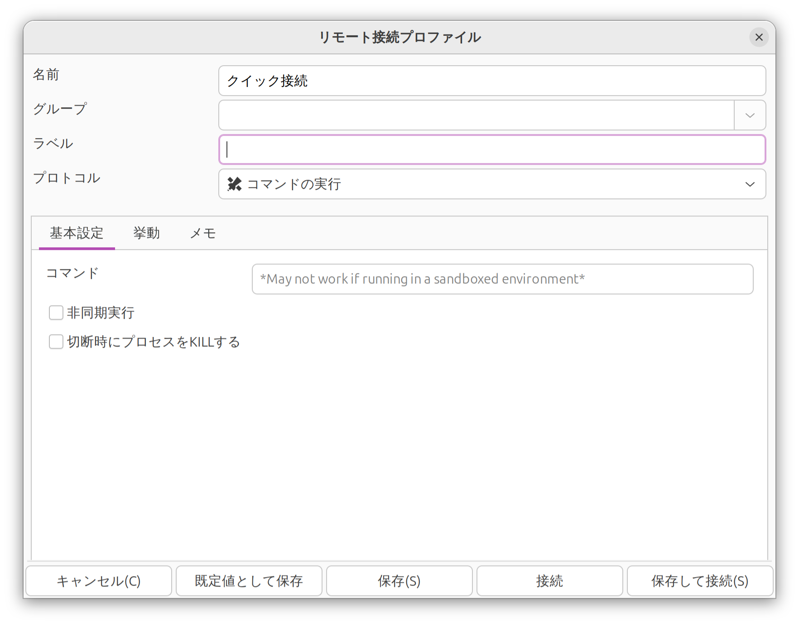

## Flatpakアプリの中華フォント対策

- https://github.com/flatpak/flatpak/issues/5425
- https://okutom.hatenablog.com/entry/2024/11/07/204055

Flatpakアプリはサンドボックス内で動くため、ホストのfontconfig設定（`/etc/fonts/conf.d/`配下のディストリ提供設定や`~/.config/fontconfig/`のユーザー設定）にアクセスできない。その結果fontconfigがフォールバック動作になり、CJK統合漢字がたまたまインストールされている中国語フォント（例: Noto Sans CJK SC）で描画され、日本語のはずの文字が「中華フォント」っぽく見えてしまう。

対策はホスト側のfontconfig設定をサンドボックスに見せること。以下の手順で実施する。

1. `mkdir -p ~/.config/fontconfig/conf.d`でユーザー領域にfontconfig設定置き場を用意。
2. `cp /etc/fonts/fonts.conf ~/.config/fontconfig/fonts.conf` / `cp -L /etc/fonts/conf.d/*.conf ~/.config/fontconfig/conf.d/`でホストの選択ロジックをユーザー設定として、シンボリックリンクは実体に解決した上でコピー。これらのディレクトリはfontconfigが要求するもので、`man 5 fonts-conf`で確認できる。
3. `sudo flatpak override --filesystem=xdg-config/fontconfig:ro`で全Flatpakアプリに対し、ホスト側`~/.config/fontconfig`を読み取り専用でサンドボックス内（`$HOME/.var/app/$FLATPAK_ID/config/fontconfig`に相当）にバインドマウントするsystem-wide overrideを設定する。
4. `rm -rf ~/.cache/fontconfig`および`rm -rf ~/.var/app/*/cache/fontconfig`で古い（中華フォントが選ばれた状態の）fontconfigキャッシュを削除し、次回起動時に再生成させる。

`flatpak override`はグローバル設定なので、これ以降にflatpakでインストールしたアプリにも自動的に適用される。

```
$ mkdir -p ~/.config/fontconfig/conf.d
$ cp /etc/fonts/fonts.conf ~/.config/fontconfig/fonts.conf
$ cp -L /etc/fonts/conf.d/*.conf ~/.config/fontconfig/conf.d/
$ tree ~/.config/fontconfig/
/home/mukai/.config/fontconfig/
├── conf.d
│   ├── 10-hinting-slight.conf
│   ├── 10-scale-bitmap-fonts.conf
│   ├── 10-sub-pixel-rgb.conf
...
│   ├── 80-delicious.conf
│   ├── 90-synthetic.conf
│   └── 99-language-selector-zh.conf
└── fonts.conf

2 directories, 63 files
$ sudo flatpak override --filesystem=xdg-config/fontconfig:ro
  # アプリごとに設定する場合（例: Remmina のみ）
  # $ sudo flatpak override --filesystem=xdg-config/fontconfig:ro org.remmina.Remmina

$ rm -rf ~/.cache/fontconfig
$ rm -rf ~/.var/app/*/cache/fontconfig

$ flatpak run org.remmina.Remmina
```

設定前



設定後


