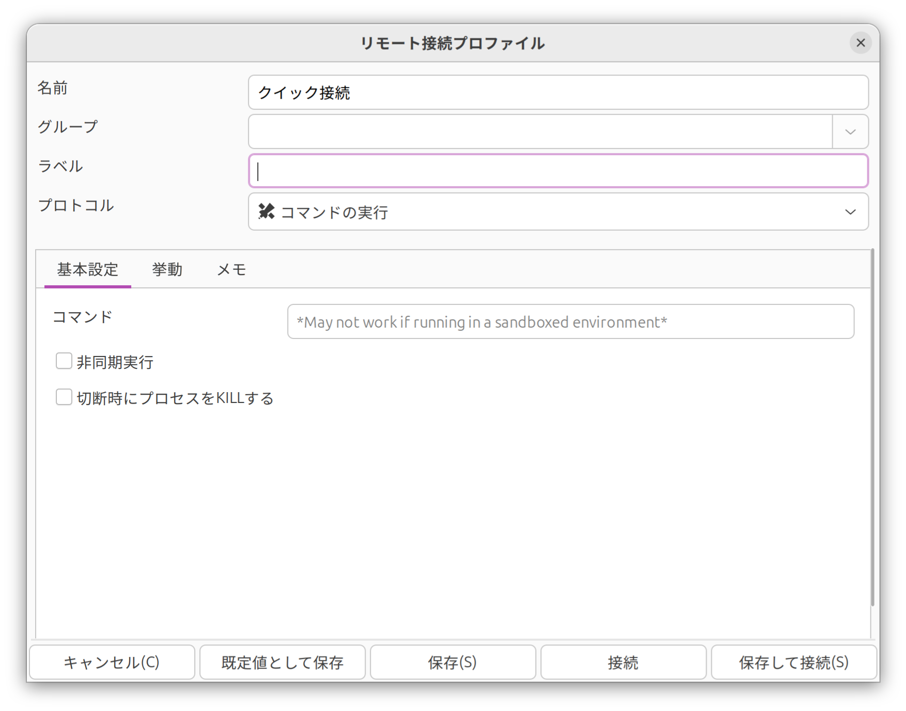

## Flatpakアプリの中華フォント対策

- https://github.com/flatpak/flatpak/issues/5425
- https://okutom.hatenablog.com/entry/2024/11/07/204055

Flatpakアプリはサンドボックス内で動くため、ホストのfontconfig設定（`/etc/fonts/conf.d/`配下のディストリ提供設定や`~/.config/fontconfig/`のユーザー設定）にアクセスできない。その結果fontconfigがフォールバック動作になり、CJK統合漢字がたまたまインストールされている中国語フォント（例: Noto Sans CJK SC）で描画され、日本語のはずの文字が「中華フォント」っぽく見えてしまう。

fontconfigはユーザー設定として`$XDG_CONFIG_HOME/fontconfig/`（`man 5 fonts-conf`で確認できる）を読み込むが、Flatpakサンドボックス内では`$XDG_CONFIG_HOME`が`~/.var/app/$FLATPAK_ID/config`に書き換えられる。したがって、ホストの`~/.config/fontconfig/`を`flatpak override --filesystem=xdg-config/fontconfig`で見せても、サンドボックス内のfontconfigが見るパスとは噛み合わず読まれない。

対策はアプリごとの`~/.var/app/$FLATPAK_ID/config/fontconfig/`配下にホストのfontconfig設定を配置すること。サンドボックス内fontconfigはこのパスを`$XDG_CONFIG_HOME/fontconfig/`として読みに行くので、追加のoverrideなしで反映される。以下の手順で実施する（例としてRemmina = `org.remmina.Remmina`）。

1. `mkdir -p ~/.var/app/org.remmina.Remmina/config/fontconfig/conf.d`で対象アプリのper-app config配下にfontconfig設定置き場を用意。
2. `cp /etc/fonts/fonts.conf ~/.var/app/org.remmina.Remmina/config/fontconfig/fonts.conf` / `cp -L /etc/fonts/conf.d/*.conf ~/.var/app/org.remmina.Remmina/config/fontconfig/conf.d/`でホストの選択ロジックを、シンボリックリンクは実体に解決した上でコピー。
3. `rm -rf ~/.var/app/org.remmina.Remmina/cache/fontconfig`で古い（中華フォントが選ばれた状態の）fontconfigキャッシュを削除し、次回起動時に再生成させる。

```
$ APP=org.remmina.Remmina
$ mkdir -p ~/.var/app/$APP/config/fontconfig/conf.d
$ cp /etc/fonts/fonts.conf ~/.var/app/$APP/config/fontconfig/fonts.conf
$ cp -L /etc/fonts/conf.d/*.conf ~/.var/app/$APP/config/fontconfig/conf.d/
$ tree ~/.var/app/$APP/config/fontconfig/
/home/mukai/.var/app/org.remmina.Remmina/config/fontconfig/
├── conf.d
│   ├── 10-hinting-slight.conf
│   ├── 10-scale-bitmap-fonts.conf
│   ├── 10-sub-pixel-rgb.conf
...
│   ├── 80-delicious.conf
│   ├── 90-synthetic.conf
│   └── 99-language-selector-zh.conf
└── fonts.conf

2 directories, 63 files
$ rm -rf ~/.var/app/$APP/cache/fontconfig

$ flatpak run $APP
```

設定前


設定後


