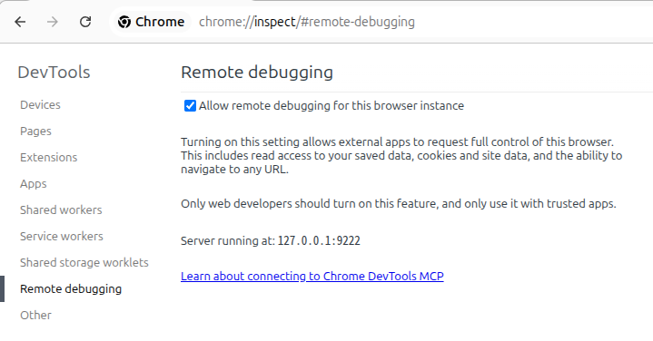

## Chrome DevTools for agents（chrome-devtools-mcp）で、起動中のインスタンスに接続する

[ChromeDevTools/chrome-devtools-mcp@ed02047](https://github.com/ChromeDevTools/chrome-devtools-mcp/tree/ed02047ae90f25c4c15adb8fd7e224b963f43135)

接続したいインスタンスで、[chrome://inspect/#remote-debugging](chrome://inspect/#remote-debugging)を開き、デバッグ接続を許可する。



Claude CodeでのMCP設定（.mcp.json）は次の通り。

```json
{
  "mcpServers": {
    "chrome-devtools": {
      "command": "npx",
      "args": ["chrome-devtools-mcp@latest", "--autoConnect"]
    }
  }
}
```

接続を試みる際に許可ダイアログが表示される。MCPクライアントを起動し、例えば次のようなメッセージでウォームアップする。

```
This is a warm-up to confirm the Chrome DevTools MCP server is connected to my running Chrome. Just list the pages currently open in my browser, then stop.
```

> メモ：予めデバッグポートを開放して起動する際はユーザーデータの退避が必要になり、これだと起動中のChromeと条件が揃わない。
> 
> ```
> $ google-chrome --remote-debugging-port=9222 --user-data-dir=/tmp/chrome-profile-stable
> ```
> 
> ```json
> {
>   "mcpServers": {
>     "chrome-devtools": {
>       "command": "npx",
>       "args": ["chrome-devtools-mcp@latest", "--browser-url=http://127.0.0.1:9222"]
>     }
>   }
> }
> ```

> メモ：Remote Debuggingページには`Server running at: 127.0.0.1:<port>`と表示されるのだが、`GET /json/version`に応答せず実態のWebSocketに到達できないようになっている。つまり上の設定を`--browserUrl http://127.0.0.1:9222`にしても自動接続にならず、失敗する。
